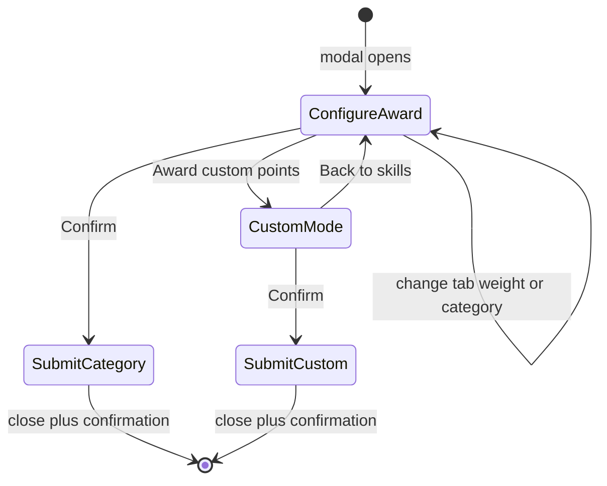

# Award Points Modal — UI Upgrade

**Status:** Implemented (June 2026)  
**Canonical for:** Award modal layout, workflow, and points contract after upgrade  
**UI component:** `src/features/dashboard/components/modals/AwardPointsModal.tsx`

---

## 1. Summary

The Award Points modal changed from **instant award on skill card click** to a **select-then-confirm** workflow:

1. Modal opens with defaults (Positive tab, +1 weight, General category).
2. Teacher optionally changes tab, weight, or category.
3. Teacher clicks **Confirm** to submit.

Custom points are **hidden by default** and expand only when the teacher clicks **Award custom points**.

All entry points (`DashboardClassModalsHost`, `Random.tsx`) still use `AwardPointsModalHost` — only the modal UI and Layer 1 state changed.

---

## 2. Mockup reference

Layout sections (top to bottom):

| Section | Description |
|---------|-------------|
| Header | Student avatar + name (or whole-class / multi-student / multi-class label) |
| Tab bar | Two pills: **Positive Points** (heart) \| **Negative Points** (warning) |
| Award point weight value | Two rows: `+1`…`+5` and `+6`…`+10` (or `-1`…`-10`; yellow highlight on selection) |
| Choose achievement category | Selectable skill cards + Add skills / Edit Skills action cards |
| Custom block | Hidden until custom mode; memo + Custom Pts |
| Footer | Cancel (left) \| Confirm with checkmark (right) |

### Sticky footer layout

The modal uses a **three-zone flex column** when `fixedTop` is enabled on the shared `Modal` shell:

- **Pinned top:** header, tabs, weight row, and the "Choose achievement category" label.
- **Scrollable middle:** category card grid only (`flex-1 min-h-0 overflow-y-auto`).
- **Pinned bottom:** "Award custom points" link (when not in custom mode) and Cancel / Confirm actions.

Confirm and Cancel remain visible even when many category cards overflow the viewport.

### Compact category grid

Category cards use `size="compact"` on [`SkillCard`](../src/features/dashboard/components/cards/SkillCard.tsx) and [`SkillActionCard`](../src/features/dashboard/components/cards/SkillActionCard.tsx):

- **Grid:** `grid-cols-3 sm:grid-cols-4 md:grid-cols-5 gap-2` — target **2 rows × 5 columns (10 cards)** visible at `md+` desktop widths.
- **Card scale:** 48px icons, `p-2`, `rounded-xl`, truncated labels.
- **Scroll region:** `flex-1 min-h-0 overflow-y-auto` — additional cards scroll inside the middle zone only; compact sizing + 5 columns target ~10 visible at desktop widths.

Edit Skills modal ([`EditSkillCard`](../src/features/dashboard/components/cards/EditSkillCard.tsx)) keeps the larger card size.

### Category order (stable deck)

`point_categories.sort_order` controls grid position within each class and type (positive / negative):

| `sort_order` | Role |
|--------------|------|
| `0` | Default slot (General) — always top-left; cannot be deleted (rename/icon OK) |
| `1+` | RPC default skills (backfill) and teacher-added skills in stable order |

- **Edits** change name/icon only — `sort_order` is never updated.
- **New skills** append at `max(sort_order) + 1`.
- Award modal and Edit Skills modal use the same `sortPointCategoriesForDisplay` ordering.

---

## 3. Workflow

| Step | Optional? | Default | Action |
|------|-----------|---------|--------|
| Open modal | — | — | Triggered by student card, whole class, multi-select, seating, Random |
| Tab | Yes | Positive Points | Switch to Negative Points |
| Weight | Yes | +1 (or -1 on negative tab) | Tap +2…+10 / -2…-10 |
| Category | Yes | General (per tab) | Tap another skill card |
| Confirm | **Required** | — | Submits award |
| Custom mode | Yes | Off | Tap **Award custom points** → fill memo/points → Confirm |

**Fast path:** Open modal → Confirm (defaults only).

---

## 4. State machine

### Reset rules

- On `isOpen === true`: reset tab to positive, weight to 1, custom mode off, custom fields cleared.
- On tab switch: weight → 1, exit custom mode, select General for new tab.
- After successful award: modal closes (existing behavior).

---

## 5. Points contract (weight-only)

| Field | Value |
|-------|-------|
| `point_events.points` | Selected weight (+1…+10 or -1…-10) |
| `point_events.category_id` | Selected category (reason/label) |
| Category `points` column | **Not used** at award time; kept for DB compatibility |

Custom awards still use `custom_point_events` (no `category_id`).

---

## 6. General category (lazy seed)

On first modal open per class, `ensureDefaultGeneralCategories(classId)`:

- Inserts positive **General** (`points: 1`, `type: positive`) if missing.
- Inserts negative **General** (`points: -1`, `type: negative`) if missing.
- Idempotent by `name === 'General'` + sign.

**Edit rules:**

- Rename and icon change allowed via Edit Skills.
- Archive/delete **blocked** for General categories.

---

## 7. Custom mode

- Trigger: **Award custom points** link below category grid.
- Effect: expand modal content, disable weight row + category grid + Add/Edit cards.
- Positive tab: custom points awarded as positive magnitude.
- Negative tab: UI prefixes `-`; magnitude entered, stored as negative.
- **Back to skills** exits custom mode.

---

## 8. File change matrix

| Layer | File | Change |
|-------|------|--------|
| Layer 3 | `features/dashboard/lib/api/skills.ts` | `ensureDefaultGeneralCategories`, `GENERAL_CATEGORY_NAME` |
| Layer 1 | `hooks/useSubmitPointAward.ts` | `awardSkill(category, pointsOverride)` |
| Layer 1 | `hooks/useAwardPointsModalState.ts` | Selection state, confirm handler, custom mode |
| Layer 1 | `hooks/useAwardPointsModalController.ts` | Pass new view props |
| Layer 1 | `hooks/useEditSkillsModalController.ts` | Block General delete |
| Tier 3 | `components/modals/AwardPointsModal.tsx` | New layout |
| Tier 3 | `components/cards/SkillCard.tsx` | `isSelected`, compact size (no points badge) |
| Tier 3 | `components/award-points/AwardPointsTabBar.tsx` | Tab pills |
| Tier 3 | `components/award-points/AwardPointsWeightRow.tsx` | Weight buttons |

**Unchanged:** `AwardPointsModalHost`, `DashboardClassModalsHost`, `Random.tsx`, `useModalStore`, `src/app/`.

---

## 9. Manual test plan

- [ ] Grid: click student → Confirm with defaults → points +1, General category in log
- [ ] Grid: change weight to +10, pick category → Confirm → +10 applied
- [ ] Whole class card → Confirm → all present students updated
- [ ] Multi-select → Award Points → Confirm
- [ ] Seating seat click → Confirm
- [ ] Seating group header → Confirm (absent excluded)
- [ ] Random: single student + list award
- [ ] Negative tab: -7 weight, category, Confirm
- [ ] Custom mode: expand, memo, Confirm; Back to skills collapses
- [ ] Edit Skills: cannot delete General; can rename/icon
- [ ] Add skill still works from modal (name + icon only; ±1 sign derived in API)
- [ ] Edit skill: rename + icon change only; no points field in forms

---

## 10. Skill forms (no per-skill points)

Add/Edit skill forms collect **name + icon** only. The active award tab sets `type` (positive/negative) at creation time.

| Layer | Behavior |
|-------|----------|
| Tier 3 forms | No points input |
| Layer 1 `useSkillManagement` | Passes `type` on create |
| Layer 3 `createSkill` | Writes `points: ±1` and `type` to DB |
| Layer 3 `updateSkill` | Updates `name` and `icon` only |

Award amount is always chosen via the weight row at confirm time.

---

## 11. Out of scope / follow-ups

- Multi-class `selectedClassIds` award mode (UI exists but no caller).
- Seating single-student header showing "1 Selected Student" vs student name.

---

## Related docs

- [`teacher-workflows.md`](teacher-workflows.md) — section E (WF-40–48)
- [`db-schema.md`](db-schema.md) — `point_categories`, `point_events`, `custom_point_events`
- [`architecture-plan.md`](architecture-plan.md) — host + controller pattern
