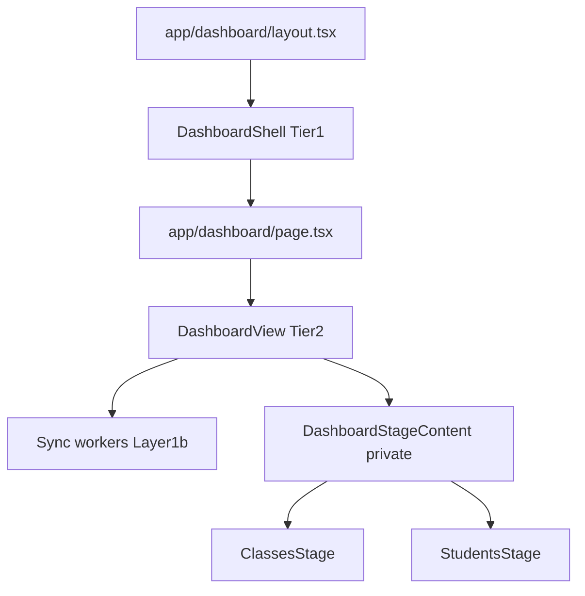
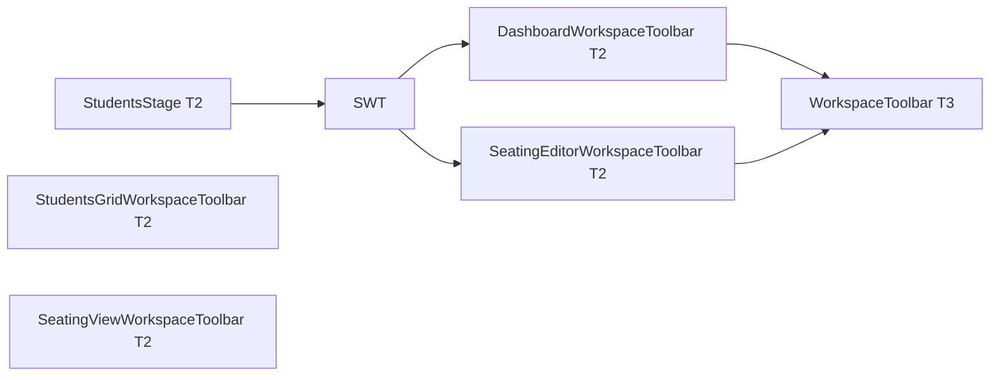
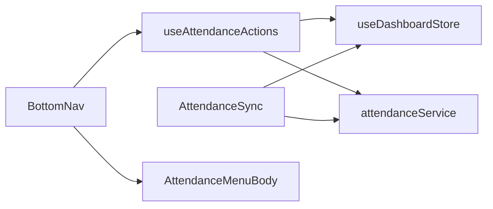

# KIS-Points Architecture Plan

Prototype 1 uses a **dual-shell** layout model and a **dual-boundary** data model:

- **Visual 3-Tier:** where React components live and what they may render.
- **Data 3-Layer:** how state and Supabase interact.

**Status (May 2026):**

- Zustand migration is effectively complete; dashboard global state does not use React Context.
- **Feature-first layout (complete May 2026):** Dashboard **Tier 1 frame** lives only in `src/features/dashboard/components/frame/` + `layouts/DashboardShell.tsx`. **Tier 2** orchestration at `src/features/{dashboard,classes,students,seating}/` (feature roots). **Tier 3** UI in `src/features/{dashboard,classes,students,seating}/components/` (other features’ `components/` are Tier 3 only, not frame). Auth/landing Tier 3 under `src/features/{auth,landing}/components/`. Shared primitives only in `src/components/ui/`. **Modal flows** that need Layer 1 wiring above a presentational modal use a **Tier 2 host in `features/dashboard/` + controller hook in `src/hooks/`** (see §1.3 / §1.4).
- **Auth routes:** grouped under `src/app/(auth)/` (route group; URLs unchanged). Auth flex shell in `src/features/auth/layouts/AuthShell.tsx`; `src/app/(auth)/layout.tsx` thin-wires the shell (mirrors dashboard + `DashboardShell`).
- **Auth/landing (Tier 2):** views in `src/features/auth` and `src/features/landing` (not subject to the dashboard `components/` vs `features/` tier split).
- **Student attendance:** daily `attendance_events` append-only log, `absentStudentIds` in the dashboard store, bottom-nav attendance sheet, and macro point exclusions for absent students (see §2.1).
- **Dashboard stage entry (May 2026):** `src/features/dashboard/DashboardView.tsx` — single route-level view (sync workers + `activeView` routing). Replaces the former `frame/DashboardView.tsx` + `DashboardViewSwitch.tsx` split; matches auth/landing `page → *View` import symmetry.

Related docs: `docs/visual-layer-map.md` (canonical visual file tree), `docs/tech-stack.md`, `docs/zustand-migration-plan.md`, `docs/3-tier-3-layer-refactor-plan.md`, `docs/db-schema.md`, `docs/featureFirstMigrationPlan.md` (completed move from `components/dashboard` and `components/ui/{auth,landing}` → `features/*/components/`).

---

## 0. Dual shells (identify the shell first)

### A. Auth & landing shell

Auth and landing are **not** subject to the dashboard `components/` vs `features/` tier split. **Route chrome** lives in `src/features/{auth,landing}/layouts/`; segment layouts in `src/app/(auth)/` and `src/app/(landing)/` only wire shells.

| Concern | Location |
|---------|----------|
| Tier 1 auth | `src/features/auth/layouts/AuthShell.tsx` (mounted from `src/app/(auth)/layout.tsx`) |
| Tier 1 landing | `src/features/landing/layouts/LandingShell.tsx` (pass-through; mounted from `src/app/(landing)/layout.tsx`) |
| Tier 2 views | `src/features/auth/LoginView.tsx`, `SignUpView.tsx`, `ForgotPasswordView.tsx`, `ResetPasswordView.tsx` (forms only; no layout wrapper) |
| Tier 2 landing | `src/features/landing/LandingView.tsx` |
| Tier 3 UI | `src/features/auth/components/`, `src/features/landing/components/` |
| Layer 1 | `src/hooks/useAuthFlow.ts` |
| Layer 3 | `src/lib/api/auth.service.ts` |
| Routes | Thin `src/app/(auth)/login|signup|.../page.tsx` → `@/features/auth/*`; `src/app/(landing)/page.tsx` → `@/features/landing/LandingView` (URL `/` unchanged) |

### B. Dashboard shell — frame in `dashboard/components/frame`; Tier 3 in `features/*/components`

| Concern | Location |
|---------|----------|
| Tier 1 | `src/features/dashboard/components/frame/` + `src/features/dashboard/layouts/DashboardShell.tsx` |
| Tier 2 | `src/features/dashboard/`, `classes/`, `students/`, `seating/` |
| Tier 3 | `src/features/{dashboard,classes,students,seating}/components/` + `src/components/ui/` (shared) |
| Layer 1 / 1b | `src/hooks/`, `src/hooks/sync/` |
| Layer 2 | `src/stores/` |
| Layer 3 | `src/lib/api/` |
| Routes | Thin `src/app/dashboard/*/page.tsx` → `<DashboardView />` (sync + stage routing) |

**Rule:** Do not apply dashboard grid/zone rules to auth/landing, or auth flex centering rules to the dashboard workspace.

### 0.1 Thin `src/app/` policy (frozen)

`src/app/` is the **routing table only**. Product logic, shells, sync, and view switching live under `src/features/`.

| Rule | Detail |
|------|--------|
| **Stay dumb** | `layout.tsx` / `page.tsx` should be ~5–10 lines: one shell or view import, one default export, no hooks, no stores, no Supabase. |
| **No growth in app** | If a `page.tsx` needs hooks, sync workers, or orchestration → move it to `src/features/`. |
| **Do not touch `app/` by default** | Do **not** change files under `src/app/` unless the task **explicitly** requires a new route, URL, segment layout wire, or framework boundary (e.g. `Suspense` for `useSearchParams`). Refactors belong in `src/features/`. |
| **Symmetric pages** | Dashboard `page.tsx` and `classes/[classId]/page.tsx` both render `<DashboardView />` from `@/features/dashboard/DashboardView.tsx` only. |
| **Layout vs page split** | `app/dashboard/layout.tsx` → `DashboardShell` (chrome). `app/dashboard/*/page.tsx` → `DashboardView` (sync + stage routing). Do not hoist `DashboardView` into layout without an explicit, documented win. |

**Dashboard stage entry:** `src/features/dashboard/DashboardView.tsx` consolidates sync workers, pathname-derived `key`, route guard, and `activeView` → `ClassesStage` / `StudentsStage`. Matches auth/landing `page → *View` symmetry. Do not split routing into `app/` or reintroduce `DashboardViewSwitch`.

`getDashboardClassIdFromPath()` lives in `DashboardView.tsx` (done).

**Dashboard render tree (as implemented):**



| Import path | Role |
|-------------|------|
| `@/features/dashboard/DashboardView` | **Only** import from dashboard `page.tsx` files |
| Internal `DashboardStageContent` | `activeView` switch + class-route guard (not exported) |
| `ClassesStage` / `StudentsStage` | Per-view `StageTwoColumnSplit` + workspace content + toolbar |

---

## 1. Visual 3-Tier — dashboard folder policy

**Canonical file tree:** [`docs/visual-layer-map.md`](visual-layer-map.md) (every visual file with T1/T2/T3 labels).

### 1.1 Folder ↔ tier (dashboard only)

| Tier | Role | Location |
|------|------|----------|
| **1** | Scaffolding, chrome, zones | `src/features/dashboard/components/frame/`, `layouts/DashboardShell.tsx` |
| **2** | View containers, workspaces, orchestration | `src/features/{dashboard,classes,students,seating}/` (root `*View`, `*Workspace`, hosts) |
| **3** | Presentational UI | `src/features/{dashboard,classes,students,seating}/components/`, `src/features/auth/components/`, `src/features/landing/components/`, `src/components/ui/` |

`src/features/` is the permanent home for auth, landing, and dashboard Tier 2. Do not move auth views into `components/` for folder-policy reasons. Auth route chrome lives in `src/features/auth/layouts/AuthShell.tsx`; `src/app/(auth)/layout.tsx` only imports it.

### 1.2 Tier 1 — Scaffolding (`features/dashboard/components/frame/`)

**Responsibility:** Persistent chrome, routing bounds, zone assignment. Reads layout/UI slices for chrome only (no Supabase, no mutation orchestration). Sync + stage routing live in Tier 2 `DashboardView.tsx`.

| Path | Role |
|------|------|
| `features/dashboard/layouts/DashboardShell.tsx` | Shell grid (sidebar + top/footer chrome); main stage is `{children}` only |
| `app/dashboard/layout.tsx` | Suspense + `DashboardShell` (thin wire); `DashboardClassesSync` mounted in shell |
| `frame/dashboardZoneConfig.ts` | Shell sidebar grid + main-stage row class constants |
| `components/ui/StageTwoColumnSplit.tsx` | Workspace-owned 2-col layout (`children` + `rightRail`) |
| `frame/navbars/*` | Left/top/bottom nav (`BottomNav`, `SeatingEditorLeftNav`, etc.) |

Navbars may use **narrow** store selectors (e.g. `LeftNav` → `activeClassId`, `viewMode`) because they are shell chrome, not workspace orchestration.

**Dashboard 7-zone grid (conceptual)**

| Zone | Role |
|------|------|
| 1 | Left nav (classes, seating layouts) |
| 2–3 | Header / top nav |
| 4–5 | Main stage (`StageTwoColumnSplit`: workspace + canvas toolbar rail) |
| 6–7 | Footer / bottom toolbars |

**Rules**

- Prefer `h-full` / `min-h-0` inside the dashboard; avoid `h-screen` in nested workspace content.
- URL-reflected UI (`activeView`, edit mode, active class) is mirrored from the route via `src/hooks/sync/*`, not ad hoc `useEffect` in Tier 1.
- **Dashboard tools:** `DashboardToolsHost` portaled — Timer (`MovableToolPanel` + `components/tools/Timer.tsx`), Random (`LargeToolModal` + `tools/Random.tsx`, 90% viewport). Canvas always shows `{children}`.

### 1.3 Tier 2 — Stage (`features/`)

**Responsibility:** Choose which workspace is visible; wire Layer 1 hooks; subscribe to stores; pass props into Tier 3 children.

| Module path | Files |
|-------------|-------|
| `features/dashboard/` | **`DashboardView.tsx`** (route entry: sync + `DashboardStageContent` routing), `DashboardToolsHost.tsx`, `DashboardClassModalsHost.tsx`, `AwardPointsModalHost.tsx`, `EditSkillsModalHost.tsx`, `stage/dashboardToolbarConfig.ts`, `stage/workspaceToolbarPresets.tsx`, `stage/DashboardWorkspaceToolbar.tsx`, `tools/Random.tsx` |
| `features/classes/` | `ClassesStage.tsx`, `ClassesStageContent.tsx`, `ClassesGridWorkspace.tsx`, `ClassCardsGrid.tsx`, `EditClassModalRoot.tsx`, `ClassesGridWorkspaceToolbar.tsx` |
| `features/students/` | `StudentsStage.tsx`, `StudentsStageContent.tsx`, `StudentsGridWorkspace.tsx`, `StudentsCardsGrid.tsx`, `StudentsGridWorkspaceToolbar.tsx` |
| `features/seating/` | `SeatingChartView.tsx`, `SeatingChartEditorView.tsx`, `SeatingChartWorkspace.tsx`, `SeatingChartEditorWorkspace.tsx`, `SeatingGroupsCanvas.tsx`, `SeatingEditorWorkspaceToolbar.tsx` |

**Workspace toolbar rails (view-owned via `StageTwoColumnSplit`):**

- `ClassesGridWorkspace` mounts `ClassesGridWorkspaceToolbar` (all actions **disabled** on `/dashboard`).
- Each workspace mounts its own toolbar: `StudentsGridWorkspaceToolbar`, `SeatingViewWorkspaceToolbar`, `SeatingEditorWorkspaceToolbar`.



**Award / edit-skills modal pattern (reuse for similar features):**

- **Tier 2 host** (`features/dashboard/*Host.tsx`): thin component; calls `use*ModalController(...)`, renders Tier 3 modal with `{...viewProps}`.
- **Layer 1 controller** (`hooks/use*ModalController.ts`): composes existing hooks (`usePointAwarding`, `useSkillManagement`, `useAvailable*Icons`, etc.); returns a single **view-props object** typed next to the modal (e.g. `AwardPointsModalViewProps`).
- **Tier 3 modal** (`features/dashboard/components/modals/*`): no `@/hooks` for orchestration (except documented exceptions elsewhere); props in, callbacks out.
- **Nested composition:** a Tier 3 modal may render another **Tier 2 host** when a subtree has its own controller (e.g. `AwardPointsModal` renders `EditSkillsModalHost`; avoid duplicating that logic in `useAwardPointsModalController`).

**Rules**

- Tier 2 may import Layer 1 hooks and stores; it must not call Supabase clients directly for runtime mutations.
- Type-only imports from `@/lib/api/*` are acceptable.
- Prefer `dashboardStudentSelectors.ts` for roster ordering/aggregates.
- For new dashboard modal flows similar to award points / edit skills: add a **host** under `features/dashboard/` + **controller hook** under `hooks/`, keep modal + child forms Tier 3 (no `@/stores`, no `@/hooks` inside presentational forms).

### 1.4 Tier 3 — Actors (`features/*/components/` + `components/ui/`)

**Responsibility:** Presentation; props in, callbacks out.

```text
features/dashboard/components/   # frame, cards, modals, menus, forms, tools, PointsLogDrawer
features/classes/components/
features/students/components/
features/seating/components/
features/auth/components/          # forms + auth chrome
features/landing/components/
components/ui/                     # shared atoms, icons, WorkspaceToolbar, generic modals
```

**Rules**

- Default: no stores, no **`@/hooks`** (orchestration), no API clients. Local UI state (`useState`, refs, DOM `useEffect` for focus/click-outside) is fine.
- **`forms/AddSkillForm.tsx`**, **`forms/EditSkillForm.tsx`**: strict Tier 3 — **no `@/hooks`**. Icon paths and detection flags (`useAvailablePositiveIcons` / static negative list) plus submit handlers (`addSkill`, `updateSkill` + refresh) are wired in **`useAwardPointsModalController`** and **`useEditSkillsModalController`**, then passed through modal shells (`AddSkillModal`, `EditSkillModal`, nested hosts as needed).
- **Documented exceptions (under `features/*/components/`, not generic `components/ui`):**
  - `features/students/components/cards/StudentCard.tsx` — `useShallow` store slice for grid performance.
  - `features/dashboard/components/modals/EditSkillsModal.tsx` — presentational; orchestration in `hooks/useEditSkillsModalController.ts` + Tier 2 `features/dashboard/EditSkillsModalHost.tsx`.
  - `features/dashboard/components/modals/AwardPointsModal.tsx` — presentational; orchestration in `hooks/useAwardPointsModalController.ts` + Tier 2 `features/dashboard/AwardPointsModalHost.tsx`.
  - `features/classes/components/cards/ClassCard.tsx` — reads `viewPreference` only.
  - `features/classes/components/modals/EditClassModal.tsx` — thin façade re-exporting `features/classes/EditClassModalRoot.tsx`.

### 1.5 Notable Tier 3 files (by feature)

| File | Notes |
|------|-------|
| `features/dashboard/components/PointsLogDrawer.tsx` | Props only; workspace owns data |
| `features/students/components/menus/AttendanceMenuBody.tsx` | Props only; checkbox roster for daily absences (wired from `BottomNav`) |

---

## 2. Data 3-Layer separation (the flow)

**React Context is forbidden for global application state** (see `docs/tech-stack.md`).

### Layer 1 — Orchestrators (`src/hooks/`)

**Responsibility:** Business flow, optimistic updates, error rollback, coordination across stores.

**Patterns**

1. UI event or sync worker triggers the hook.
2. Update Layer 2 immediately when the UX should feel instant.
3. Call Layer 3 to persist.
4. Revert or refetch Layer 2 on failure.

**Examples**

| Concern | Hook(s) |
|---------|---------|
| Point awards | `useAwardPointsService.ts`, `useAwardPointsFlow.ts`, `usePointAwarding.ts` |
| Class CRUD / archive | `useClassActions.ts`, `useClassManagement.ts`, `useClassesWorkspaceActions.ts` |
| Student modals / selection | `useStudentsModalsState.ts`, `useStudentsSelection.ts`, `useDashboardClassModalsActions.ts` |
| Random student tool | `useRandomStudentFlow.ts` |
| Seating editor canvas | `useSeatingChart.ts`, `useSeatingLayoutManager.ts`, `useSeatingEditorToolbarActions.ts` |
| Session / logout | `useDashboardSessionActions.ts` |
| Auth forms | `useAuthFlow.ts` |
| Workspace toolbar presets | `hooks/dashboard/useWorkspaceToolbarActions.ts` (preset actions via window events) |
| Seating editor toolbar state/actions | `useSeatingEditorToolbarActions.ts` (view settings, groups, auto-assign/randomize; consumed by `SeatingEditorWorkspaceToolbar`) |
| Award points modal (controller) | `useAwardPointsModalController.ts` (composes `usePointAwarding`, `useSkillManagement`, `useAvailable*` for add-skill UX) |
| Edit skills modal (controller) | `useEditSkillsModalController.ts` (list/delete/edit orchestration + icon picker data for `EditSkillForm`) |
| Daily attendance toggle | `useAttendanceActions.ts` |
| Attendance hydration | `useAttendanceSync.ts` (`AttendanceSync`) |
| Batch points open (seating group) | `useBatchPointsAward.ts` → `openMultiStudentPointsAward` |
| UI utilities | `useAnchoredDropdownPortal.ts` (portaled dropdown positioning), `useSortedStudents.ts`, `useClassPointLog.ts`, `useStudentsUrlState.ts`, `useStudentsToolbarEvents.ts`, `useDashboardToolbarInset.ts`, `useSkillManagement.ts`, `useAvailableIcons.ts` |

Pure helpers (no React): `src/lib/awardPointsService.ts` (includes `filterEligibleStudentIds` for bulk awards vs `absentStudentIds`), `src/lib/seatingLogic.ts`, `src/lib/iconUtils.ts`.

### Layer 1b — Route & store sync (`src/hooks/sync/`)

| Worker | Role |
|--------|------|
| `useDashboardRouteStateSync.ts` | Path + query → `useLayoutStore.activeView` / `isEditMode` |
| `useDashboardStudentSync.ts` | URL class segment → `activeClassId`, roster fetch/cache |
| `useDashboardClassesSync.tsx` | Bootstrap + silent refresh of `allAccessibleClasses` |
| `useDashboardClassesFilterSync.tsx` | `viewMode` + full class list → filtered `classes` |
| `useDashboardProfileSync.tsx` | Teacher profile → `useUserStore` |
| `useSeatingChartDataSync.tsx` | Class/layout changes → `useSeatingStore` |
| `useViewPreferenceSync.ts` | Persist preferred grid vs seating view |
| `useAttendanceSync.ts` / `AttendanceSync` | Class change → clear + fetch today’s `absentStudentIds` |

**Mounting**

- `DashboardClassesSync` — `src/features/dashboard/layouts/DashboardShell.tsx`
- `DashboardStudentSync`, `SeatingChartDataSync`, `DashboardProfileSync`, `DashboardClassesFilterSync` — `src/features/dashboard/DashboardView.tsx`
- `AttendanceSync` — **recommended** in `src/features/dashboard/DashboardView.tsx` next to `DashboardStudentSync` (hydrates absences on class load; toggles work in-session without it)
- `useDashboardRouteStateSync`, `useViewPreferenceSync` — `src/features/dashboard/layouts/DashboardShell.tsx`

### Layer 2 — Desk (global + feature stores)

| Store | Location | Owns |
|-------|----------|------|
| `useLayoutStore.ts` | `src/stores/` | `activeView`, sidebar, multi-select, timer/random overlays, edit mode flags |
| `useModalStore.ts` | `src/stores/` | Modal type, targets, open/close |
| `usePreferenceStore.ts` | `src/stores/` | `sortBy`, `viewMode`, `viewPreference` |
| `useUserStore.ts` | `src/stores/` | `teacherProfile`, profile loading |
| `useDashboardStore.ts` | `src/features/dashboard/stores/` | `activeClassId`, classes, students, `absentStudentIds`, loading, `applyPointsDelta`, `setAbsentStudentIds` |
| `useSeatingStore.ts` | `src/features/seating/stores/` | Layouts, groups, assignments, seating view settings |
| `dashboardStudentSelectors.ts` | `src/features/students/stores/` | Roster ordering/aggregate selectors (used with `useDashboardStore`) |

### Layer 3 — Vault (`src/lib/api/`)

| Module | Domain |
|--------|--------|
| `auth.service.ts` | Session, profile |
| `classes.ts` | Class records |
| `students.ts` | Roster CRUD |
| `points.ts` | Awards, logs |
| `skills.ts` | Skill definitions |
| `seating.ts` | Layouts, groups, assignments |
| `attendanceService.ts` | Daily absence log (`attendance_events`) |

Shared types: `src/lib/types.ts` (includes `AttendanceEvent`).

### 2.1 Student attendance (data + UI)

**Data model:** table `attendance_events` — see `docs/db-schema.md` §5. Type `AttendanceEvent` in `src/lib/types.ts`.

| Layer / tier | File | Role |
|--------------|------|------|
| Layer 3 | `src/lib/api/attendanceService.ts` | `logAbsence`, `removeAbsence`, `fetchDailyAbsences` (today via UTC `toISOString().split('T')[0]`) |
| Layer 2 | `useDashboardStore.ts` | `absentStudentIds: string[]` (empty = all present), `setAbsentStudentIds` |
| Layer 1 | `useAttendanceActions.ts` | `toggleAttendance(studentId)`: optimistic store update → API → silent rollback on failure |
| Layer 1b | `useAttendanceSync.ts`, `AttendanceSync` | On `classId` change: clear `absentStudentIds`, then fetch today’s absences |
| Tier 3 | `features/students/components/menus/AttendanceMenuBody.tsx` | Props: `students`, `absentStudentIds`, `onToggleAbsence`; checkbox checked = **absent**; no stores/API |
| Tier 1 chrome | `features/dashboard/components/frame/navbars/BottomNav.tsx` | Attendance button, `createPortal` bottom sheet (`data-attendance-menu`), composes actions + store |



### 2.2 Absent students and point awards

Macro flows **exclude** students in `absentStudentIds`. Manual single-student and explicit multi-select awards **do not** (teacher override).

| Flow | Excludes absent? |
|------|------------------|
| Whole class (`wholeClass`) | Yes — `resolveAwardTargetStudentIds` + `useAwardPointsService` |
| Multi-class (`multiClass`) | Yes |
| Seating group header click | Yes — `openMultiStudentPointsAward(..., { excludeAbsent: true })` |
| Multi-select footer → Award (`multiStudent`, explicit IDs) | **No** |
| Single student / seat click | **No** |
| Select All (multi-select) | Yes — `useStudentsSelection.selectAll` |
| Individual card tap in multi-select | **No** — may add absent students manually |

Early return when no eligible students remain (`eligibleStudentIds.length === 0`) with a user-facing alert.

---

## 3. Cross-cutting integration

### URL as source of truth

- **Class context:** `/dashboard/classes/[classId]`
- **Student grid vs seating:** `?view=seating` (grid is default)
- **Seating editor:** `?mode=edit`

### Optimistic UI

- Point awards: `applyPointsDelta` before `lib/api/points`; rollback on failure.
- Attendance toggles: `setAbsentStudentIds` before `attendanceService`; silent rollback on failure (`useAttendanceActions`).
- `DashboardClassModalsHost` may pass `skipRefreshAfterAward` when the store already reflects the change.

### Window event bus (legacy)

`src/lib/events/students.ts` coordinates toolbars, multi-select, and post-award cleanup. Prefer store setters + Layer 1 hooks for new features.

### Modals

- Global open state: `useModalStore`
- Mounted once: `DashboardClassModalsHost` in `DashboardShell` (`src/features/dashboard/`)
- Writers: selection hooks, seating view, `useDashboardClassModalsActions`

### Seating editor chrome (`?view=seating` + `?mode=edit`)

`DashboardShell` uses a **unified chrome** grid (`grid-rows-[auto_1fr_auto]`): TopNav (zones 2–3) and the footer slot (zone 7) stay mounted on all dashboard routes. The **main section** is a single `{children}` slot; Tier-2 views own the two-column stage via `StageTwoColumnSplit`.

When `useLayoutStore.isEditMode` is true on the seating chart view, shell and views swap several mounts:

| Zone / area | View mode | Edit mode |
|-------------|-----------|-----------|
| TopNav (header) | Always mounted | Always mounted |
| Left nav (shell) | Default `LeftNav` | `SeatingEditorLeftNav` |
| Workspace toolbar (workspace-owned) | `SeatingViewWorkspaceToolbar` → `DashboardWorkspaceToolbar` | `SeatingEditorWorkspaceToolbar` |
| Footer slot | Always mounted; `BottomNav` | Same slot; `BottomNav` with `buttonsDisabled={true}` |
| Main stage (Tier 2) | `SeatingChartView` | `SeatingChartEditorView` (via `StudentsStageContent`) |

`/dashboard` (`ClassesGridWorkspace`): toolbar rail always visible; `ClassesGridWorkspaceToolbar` with all actions **disabled**.

**There is no `SeatingEditorBottomNav`.** Editor actions live on the right-rail canvas toolbar. Footer stays visible always. **Timer** = draggable `MovableToolPanel`; **Random** = `LargeToolModal` (90vw × 90dvh); both via `DashboardToolsHost`; workspace always visible. On `/dashboard` (no class), footer renders with class-gated controls hidden inside `BottomNav`. `setTimerOpen` / `setRandomOpen` are mutually exclusive.

#### `SeatingEditorWorkspaceToolbar` (Tier 2 — `features/seating/`)

Orchestrates the editor toolbar using:

- **Tier 3 shell:** `components/ui/WorkspaceToolbar.tsx` (`topSlot`, `bottomSlot`, `topActions`, `bottomActions`)
- **Layer 1:** `useSeatingEditorToolbarActions()` (settings toggles, group actions, emits `STUDENT_EVENTS` consumed by `useSeatingChart.ts`), `useWorkspaceToolbarActions()` (Close and other preset buttons from `workspaceToolbarPresets.tsx`)
- **Tier 3 menus:** `SeatingViewSettingsMenu`, `SeatingSettingsMenu`, `SeatingEditorAddGroupsMenu` in `features/seating/components/menus/`

**Button layout (top → bottom on the rail):**

| Region | Controls |
|--------|----------|
| `topActions` | Close editor (X) |
| `topSlot` | View Settings, Auto Assign, Randomize |
| `bottomSlot` | Settings, Add Groups |
| `bottomActions` | Add group (single, `variant: 'danger'` / brand pink) |

Props from layout: `toolbarConfig`, `classId`, `onEditClass` (for Edit Class in Settings menu).

#### Portaled toolbar menus

Dropdowns are **not** absolutely positioned inside the toolbar pill (avoids clipping). `SeatingEditorWorkspaceToolbar` uses `createPortal` + `useAnchoredDropdownPortal`:

| Menu | Anchor region | Placement | Opens |
|------|---------------|-----------|-------|
| View Settings | `topSlot` | `leftOfAnchorDown` | Downward, into canvas |
| Settings, Add Groups | `bottomSlot` | `leftOfAnchorAbove` | Upward, into canvas |

Horizontal positioning for `leftOfAnchorDown` / `leftOfAnchorAbove`: menu right edge sits `gapPx` left of the button’s left edge (`left = rect.left - widthPx - gapPx`), so menus sit in the canvas area rather than hugging the viewport’s right edge.

**Tier 3 menu pattern for toolbar instances:** pass `isToolbarMenu`, `menuClassName` (e.g. `min-w-[220px]`), and portal `style`. Default `menuClassName` on each menu keeps `absolute bottom-full …` for any non-toolbar inline use.

#### Shared UI

- `components/ui/WorkspaceToolbar.tsx` — reusable vertical toolbar shell; also used by `DashboardWorkspaceToolbar`
- `features/dashboard/stage/workspaceToolbarPresets.tsx` — maps `ToolbarActionId` → icons + `STUDENT_EVENTS` dispatches

---

## 4. Directory map (as implemented)

```text
src/
  app/                              # FROZEN: thin routes only (see §0.1)
    (landing)/layout.tsx            # thin wire → features/landing/layouts/LandingShell
    (landing)/page.tsx              # → features/landing/LandingView (URL /)
    (auth)/layout.tsx               # thin wire → features/auth/layouts/AuthShell
    (auth)/login|signup|.../        # → features/auth/*View (route group; URLs unchanged)
    dashboard/
      layout.tsx                    # Suspense + DashboardShell (DashboardClassesSync in shell)
      page.tsx                      # → DashboardView
      classes/[classId]/page.tsx    # → DashboardView

  features/
    auth/                           # layouts/AuthShell, *View + components/
    landing/                        # layouts/LandingShell, LandingView + components/
    dashboard/
      layouts/DashboardShell.tsx
      components/                   # frame, cards, modals, menus, forms, tools
      DashboardView.tsx, DashboardToolsHost.tsx, *Host.tsx, stage/, tools/Random.tsx
    classes/                        # *View, *Workspace + components/
    students/
    seating/

  components/
    ui/                             # Shared Tier 3 only (primitives, icons, WorkspaceToolbar)

  hooks/          stores/           lib/api/
```

**Path aliases:** `@/components/*`, `@/features/*`, `@/hooks/*`, `@/stores/*`, `@/lib/*`.

### Moving forward (new code)

| Add this | Put it here |
|----------|-------------|
| Feature-specific UI (cards, modals, menus, forms, frame chrome) | `src/features/<feature>/components/<group>/` |
| View orchestration, workspaces, modal hosts | `src/features/<feature>/` (root, or `stage/` / `tools/` where that pattern exists) |
| Segment shell (auth flex, landing pass-through, dashboard grid) | `src/features/{auth,landing,dashboard}/layouts/` |
| Reusable atoms (inputs, `BaseCard`, `WorkspaceToolbar`, generic modals/icons) | `src/components/ui/` only |
| Routes | `src/app/` — thin wire only; **no edits** unless task explicitly requires routing/URL/layout-boundary changes (§0.1) |

**Do not:** recreate `src/components/dashboard/`; add feature UI under `components/ui/auth` or `components/ui/landing`; use `@/components/dashboard/...` imports.

---

## 5. Dashboard refactor checklist

| Status | Task |
|--------|------|
| done | Tier 1: `features/dashboard/components/frame/` + `layouts/DashboardShell` |
| done | Tier 3: `features/*/components/` (feature-first migration complete) |
| done | Tier 2: views/workspaces in `features/{dashboard,classes,students,seating}` |
| done | Move Tier 2 stragglers out of `components/dashboard/` (modal host, edit-class root, Random, SeatingGroupsCanvas, stage toolbar) |
| done | Seating editor controls on `SeatingEditorWorkspaceToolbar`; removed `SeatingEditorBottomNav` / bridge; footer uses `BottomNav` + `buttonsDisabled` in edit mode |
| done | Award points: `useAwardPointsModalController` + `AwardPointsModalHost`; Tier 3 `AwardPointsModal` |
| done | Edit skills list: `useEditSkillsModalController` + `EditSkillsModalHost`; Tier 3 `EditSkillsModal` |
| done | Skill forms Tier 3: `AddSkillForm` / `EditSkillForm` have no `@/hooks`; controllers pass icons + handlers |
| done | **Do not** move `features/auth/*` or `features/landing/*` for tier-folder policy |
| done | Attendance: schema/types, `attendanceService`, store slice, sync, actions, `AttendanceMenuBody`, `BottomNav` portal |
| done | Absent macro exclusions: `awardPointsService`, `useAwardPointsService`, `useStudentsSelection`, `useBatchPointsAward` |
| done | Thin `app/` + consolidated `DashboardView` (sync + stage routing); do not regress (§0.1) |
| todo | Mount `<AttendanceSync />` in `DashboardView.tsx` (recommended for class-load hydration) |

---

## 6. Quick reference

```text
Auth T1        →  features/auth/layouts/AuthShell (+ app/(auth)/layout.tsx wire)
Auth T2        →  features/auth/*View
Auth T3        →  features/auth/components/
Landing T1     →  features/landing/layouts/LandingShell (+ app/(landing)/layout.tsx wire)
Landing T2     →  features/landing/LandingView
Landing T3     →  features/landing/components/
Dashboard T1   →  features/dashboard/components/frame/ + layouts/DashboardShell
Dashboard T2   →  features/dashboard/DashboardView.tsx (stage entry) + features/{classes,students,seating}/*View + *Host.tsx
Dashboard T3   →  features/{dashboard,classes,students,seating}/components/ + components/ui/
Data layers    →  hooks/ · stores/ · lib/api/
Attendance     →  attendanceService · absentStudentIds · features/students/.../AttendanceMenuBody · features/dashboard/.../BottomNav
Seating edit   →  SeatingEditorWorkspaceToolbar + portaled menus; BottomNav disabled
```
