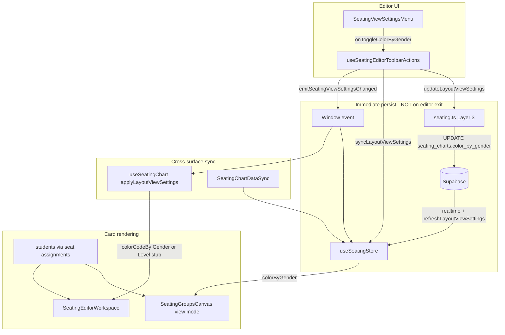
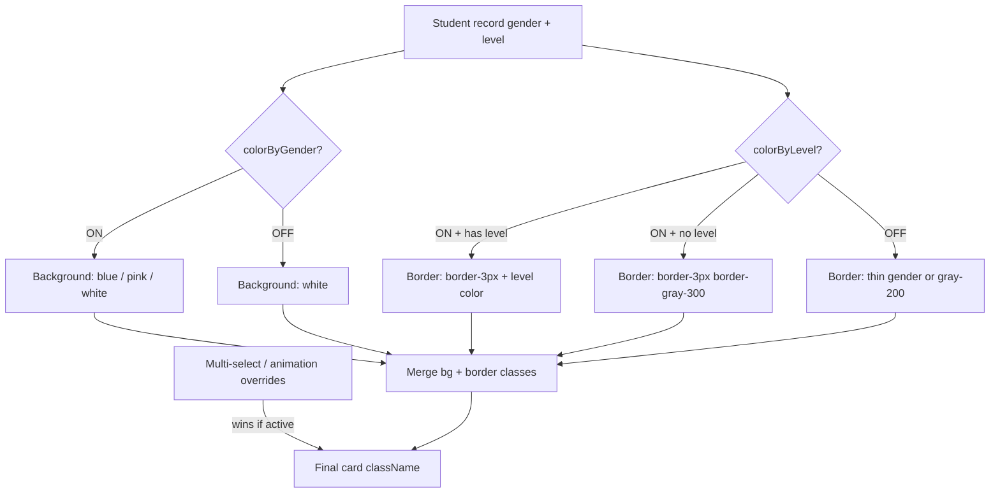
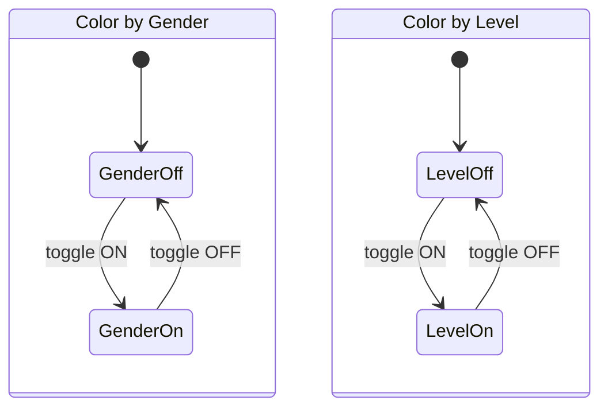
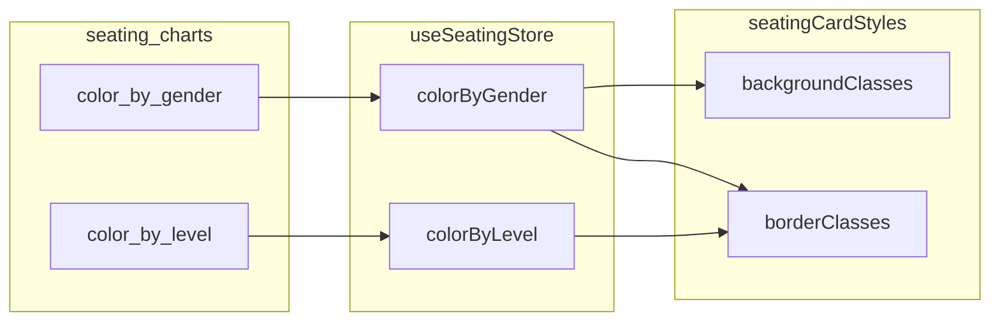
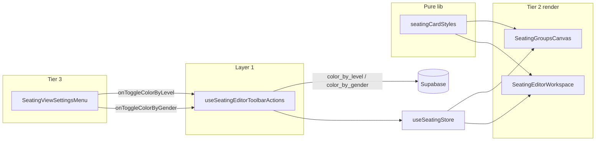

# Color by Level — Planning Document

This document has two phases:

- **Phase 1** — Understand and document how the current **Color by Gender** system works today.
- **Phase 2** — Plan how to implement the **Color by Level** toggle on the seating chart (view mode) and seating editor (edit mode).

No application code is changed by this document. It is a reference for implementation work.

---

## Phase 1 — Current "Color by Gender" System

### What the feature does

**Color by Gender** tints seated student cards on the seating canvas by each student's assigned gender. The preference is stored **per seating layout** (`seating_charts` row), not per class globally.

| State | Card appearance |
|-------|-----------------|
| Toggle **ON** (`color_by_gender = true`), student is **Boy** | `bg-blue-200 border-blue-300` |
| Toggle **ON**, student is **Girl** | `bg-pink-200 border-pink-300` |
| Toggle **ON**, student has **no gender** (null / undefined / empty string) | **White** — `bg-white border-gray-200` |
| Toggle **OFF** (`color_by_gender = false`) | **White** for all seated students |

#### Partial gender assignment (important)

The toggle is **always available** in the editor View Preferences menu, even when not all students have genders assigned. When the toggle is ON:

- Students **with** a gender get blue or pink cards.
- Students **without** a gender stay **white**.

This is intentional partial coloring, not an all-or-nothing gate. A teacher can turn on Color by Gender to see which students still need gender assigned.

#### Where the toggle lives

- **Editor mode only** — View Preferences menu on the right toolbar (`SeatingEditorWorkspaceToolbar` → `SeatingViewSettingsMenu`).
- **View mode** has **no toggle**. It reads the persisted layout setting from Zustand / Supabase and renders cards accordingly.

#### Color by Level placeholder today

The View Preferences menu shows a **disabled** "Color by Level" row. It is not wired. The old editor hook mapped `color_by_gender = false` → `colorCodeBy = 'Level'`, but that was a **stub** (white cards only) and assumed gender/level were mutually exclusive. **Phase 2 replaces that model** — see [Revised strategy](#revised-strategy-border-based--simultaneous-toggles) below.

---

### Architecture overview



---

### End-to-end data flow

#### 1. Toggle in editor (Layer 1 → Layer 3 → Layer 2)

When the teacher flips **Color by Gender** in the editor toolbar:

1. `useSeatingEditorToolbarActions.onToggleColorByGender` runs.
2. Local toolbar state updates optimistically (`setColorByGender(next)`).
3. `updateLayoutViewSettings(layoutId, { color_by_gender: next })` writes to Supabase immediately.
4. `useSeatingStore.syncLayoutViewSettings(layoutId, { color_by_gender: next })` updates the Zustand desk.
5. `emitSeatingViewSettingsChanged({ layoutId, color_by_gender: next })` broadcasts a window event so other mounted surfaces stay in sync.

**View settings persist on toggle — not on editor exit.** Closing the editor (`saveAllChangesToDatabase` in `useSeatingChart.ts`) saves group positions, column/row counts, and seat assignments only. It does **not** re-save `color_by_gender`.

#### 2. Hydration on layout load

When a layout is selected:

- **View mode:** `useSeatingLayoutManager` calls `applyLayoutViewSettings(currentLayout)` from the layouts list; `SeatingChartDataSync` and `refreshLayoutViewSettings` also fetch from Supabase.
- **Editor mode:** `useSeatingEditorToolbarActions` fetches via `fetchLayoutViewSettings(layoutId)` on mount; `useSeatingChart` does the same and maps `color_by_gender` → `colorCodeBy` (`true` → `'Gender'`, `false` → `'Level'`).

#### 3. Cross-tab / realtime sync

- `subscribeToSeatingChartRowUpdates` listens for `seating_charts` UPDATE events.
- `refreshLayoutViewSettings` re-fetches settings when the tab becomes visible again.
- `SeatingChartDataSync` listens for `SEATING_VIEW_SETTINGS_CHANGED` and re-fetches groups + view settings when editor mode ends.

#### 4. Student gender data on cards

Gender is read from the `Student` object attached to each seat assignment:

- **View mode:** `fetchSeatingGroupsWithAssignments` joins `student_seat_assignments` → `students(*)` (full row, including `gender` and `level`).
- **Editor mode:** Same join for seated students; unseated roster comes from the `students` prop passed into `SeatingEditorWorkspace` from the dashboard store.

No separate gender fetch exists for seating — it rides along with assignment queries and the class roster.

---

### Database and store shape

#### Supabase: `seating_charts`

| Column | Type | Role |
|--------|------|------|
| `color_by_gender` | `boolean` | Layout-level flag. `true` = gender background coloring ON. |
| `color_by_level` | `boolean` | Level border mode. `true` = level border coloring ON. **Exists in Supabase** (added manually; default `false`). |

Also on the same row (same view-settings bundle): `show_grid`, `show_objects`, `layout_orientation`.

New layouts default to `color_by_gender: true`, `color_by_level: false` in `createSeatingLayout`.

**Doc gap:** `docs/db-schema.md` `seating_charts` section does not yet list view-settings columns (`color_by_gender`, `color_by_level`, `show_grid`, etc.). `students.level` is already documented.

#### Zustand: `useSeatingStore`

| Field | Default | Source |
|-------|---------|--------|
| `colorByGender` | `true` | `applyLayoutViewSettings` / `syncLayoutViewSettings` from `color_by_gender` |
| `colorByLevel` | `false` | *(Phase 2)* from `color_by_level` |

The store also mirrors view settings onto each item in `layouts[]` so layout list metadata stays current.

#### Editor-only local state (today — Phase 2 refactors this)

| Location | Field | Mapping |
|----------|-------|---------|
| `useSeatingEditorToolbarActions` | `colorByGender` (boolean) | Drives toolbar toggle UI; synced with Supabase |
| `useSeatingChart` | `colorCodeBy: 'Gender' \| 'Level'` | **Legacy — to remove.** Incorrectly derived from `color_by_gender`; replaced by independent `colorByGender` + `colorByLevel` from store |

There is an unused event type `SeatingColorCodeByDetail` and `emitSeatingColorCodeBy` in `src/lib/events/students.ts` — defined but **never called**. Likely leftover from an earlier design.

---

### Card color logic (key code paths)

#### View mode — `SeatingGroupsCanvas.tsx`

Reads `colorByGender` from `useSeatingStore`. Priority order inside `renderStudentCard`:

1. Multi-select highlight → yellow
2. `!colorByGender` → white
3. No gender → white
4. Boy → blue-200
5. Girl → pink-200
6. Unknown gender value → white

```152:171:src/features/seating/SeatingGroupsCanvas.tsx
        const renderStudentCard = (student: Student) => {
          const isInSelectedGroup =
            isMultiSelectMode && selectedGroupIds.includes(group.id);
          const isExplicitlySelected =
            isMultiSelectMode && selectedStudentIds.includes(student.id);
          const isHighlighted = isInSelectedGroup || isExplicitlySelected;
          let bgColor: string;
          if (isHighlighted) {
            bgColor = 'bg-yellow-200 border-yellow-400';
          } else if (!colorByGender) {
            bgColor = 'bg-white border-gray-200';
          } else if (student.gender === null || student.gender === undefined || student.gender === '') {
            bgColor = 'bg-white border-gray-200';
          } else if (student.gender === 'Boy') {
            bgColor = 'bg-blue-200 border-blue-300';
          } else if (student.gender === 'Girl') {
            bgColor = 'bg-pink-200 border-pink-300';
          } else {
            bgColor = 'bg-white border-gray-200';
          }
```

#### Editor mode — `SeatingEditorWorkspace.tsx`

Reads `colorCodeBy` from `useSeatingChart`. Priority order:

1. Randomize animation: about-to-move → yellow; being-placed → blue
2. Selected for swap → yellow
3. `colorCodeBy === 'Gender'` → same gender rules as view mode (with hover variants)
4. `colorCodeBy === 'Level'` → **stub: always white**

```273:297:src/features/seating/SeatingEditorWorkspace.tsx
                    const renderStudentCard = (student: Student) => {
                      const isSelected = selectedStudentForSwap?.studentId === student.id && selectedStudentForSwap?.groupId === group.id;
                      const isAboutToMove = studentsAboutToMove.has(student.id);
                      const isBeingPlaced = studentsBeingPlaced.has(student.id);

                      let bgColor = 'bg-white border-gray-200 hover:bg-gray-50';
                      if (isAboutToMove) {
                        bgColor = 'bg-yellow-300 border-yellow-500 hover:bg-yellow-400';
                      } else if (isBeingPlaced) {
                        bgColor = 'bg-blue-300 border-blue-500 hover:bg-blue-400';
                      } else if (isSelected) {
                        bgColor = 'bg-yellow-300 border-yellow-500 hover:bg-yellow-400';
                      } else {
                        if (colorCodeBy === 'Gender') {
                          if (student.gender === null || student.gender === undefined || student.gender === '') {
                            bgColor = 'bg-white border-gray-200 hover:bg-gray-50';
                          } else if (student.gender === 'Boy') {
                            bgColor = 'bg-blue-200 border-blue-300 hover:bg-blue-300';
                          } else if (student.gender === 'Girl') {
                            bgColor = 'bg-pink-200 border-pink-300 hover:bg-pink-300';
                          }
                        } else {
                          bgColor = 'bg-white border-gray-200 hover:bg-gray-50';
                        }
                      }
```

#### Mapping in `useSeatingChart.ts`

```292:294:src/hooks/useSeatingChart.ts
      if (data.color_by_gender !== undefined) {
        setColorCodeBy(data.color_by_gender ? 'Gender' : 'Level');
      }
```

---

### Toggle handler — `useSeatingEditorToolbarActions.ts`

```155:167:src/hooks/useSeatingEditorToolbarActions.ts
  const onToggleColorByGender = useCallback(async () => {
    if (!layoutId) return;
    const next = !colorByGender;
    setColorByGender(next);
    try {
      await updateLayoutViewSettings(layoutId, { color_by_gender: next });
      useSeatingStore.getState().syncLayoutViewSettings(layoutId, { color_by_gender: next });
      emitViewSettingsChanged({ color_by_gender: next });
    } catch (err) {
      console.error('Unexpected error updating color_by_gender:', err);
      setColorByGender(!next);
    }
  }, [layoutId, colorByGender, emitViewSettingsChanged]);
```

The same hook handles Show Grid, Show Furniture, and Teacher's Desk Left with the identical pattern: optimistic local state → Supabase → store → event.

---

### Complete file inventory (Phase 1)

| Layer | File | Role |
|-------|------|------|
| **Tier 3 UI** | `src/features/seating/components/menus/SeatingViewSettingsMenu.tsx` | Toggle UI for Color by Gender; disabled Color by Level placeholder |
| **Tier 2** | `src/features/seating/SeatingEditorWorkspaceToolbar.tsx` | Hosts portaled View Preferences menu in editor; wires toolbar hook |
| **Tier 2** | `src/features/seating/SeatingEditorWorkspace.tsx` | Editor canvas; gender color logic via `colorCodeBy` |
| **Tier 2** | `src/features/seating/SeatingGroupsCanvas.tsx` | View-mode canvas; gender color logic via `colorByGender` |
| **Tier 2** | `src/features/seating/SeatingViewWorkspace.tsx` | View-mode workspace shell; mounts `SeatingGroupsCanvas` |
| **Tier 2** | `src/features/seating/SeatingViewWorkspaceToolbar.tsx` | View-mode toolbar (no color toggles — preset actions only) |
| **Layer 1** | `src/hooks/useSeatingEditorToolbarActions.ts` | Toggle orchestration: local state + API + store + event |
| **Layer 1** | `src/hooks/useSeatingChart.ts` | Editor chart hook; `colorCodeBy` state; layout settings fetch/sync; save on exit (assignments only) |
| **Layer 1** | `src/hooks/useSeatingLayoutManager.ts` | View-mode layout selection; applies view settings on layout change; realtime sync |
| **Layer 1b sync** | `src/features/dashboard/hooks/sync/SeatingChartDataSync.tsx` | Class/layout sync worker; refreshes view settings on editor exit |
| **Layer 1b sync** | `src/features/dashboard/hooks/sync/seatingChartRefresh.ts` | `refreshLayoutViewSettings`, `refreshSeatingGroupsForLayout`, `refreshSeatingLayoutsForClass` |
| **Layer 2 store** | `src/features/seating/stores/useSeatingStore.ts` | `colorByGender`, `applyLayoutViewSettings`, `syncLayoutViewSettings` |
| **Layer 3 API** | `src/features/seating/lib/api/seating.ts` | `fetchLayoutViewSettings`, `updateLayoutViewSettings`, `subscribeToSeatingChartRowUpdates`, `createSeatingLayout` default |
| **Events** | `src/lib/events/students.ts` | `SEATING_VIEW_SETTINGS_CHANGED`, unused `SEATING_COLOR_CODE_BY` |
| **Types** | `src/lib/types.ts` | `Student.gender`, `Student.level` |
| **Tier 1 chrome** | `src/features/dashboard/components/frame/navbars/SeatingEditorLeftNav.tsx` | Unseated student list (fixed styling — not color-by-gender) |
| **DB** | `seating_charts.color_by_gender` | Per-layout persisted boolean |

---

### Behavioral edge cases

1. **Partial gender assignment** — Mixed white and colored cards when toggle is ON. By design; no warning shown.
2. **Multi-select in view mode** — Yellow highlight overrides gender color.
3. **Editor animation / selection** — Randomize and swap-selection states override gender color with yellow or blue.
4. **Unseated list** — `SeatingEditorLeftNav` uses fixed `bg-blue-100`; not affected by Color by Gender.
5. **Unknown gender values** — Anything other than `'Boy'` / `'Girl'` falls through to white.
6. **No layout selected** — Toggle handlers no-op when `layoutId` from URL is missing.
7. **Failed Supabase update** — Toolbar hook rolls back local `colorByGender` on error.
8. **Dead code** — `emitSeatingColorCodeBy` is never invoked; safe to remove or repurpose during Level work.

---

### Phase 1 summary

Color by Gender is a **layout-scoped view setting** persisted immediately to Supabase, mirrored in Zustand, and rendered on seated student cards in both view and editor modes. Gender comes from the student record on each assignment. The toggle works even when genders are incomplete — unassigned students stay white while assigned ones color. Color by Level (Phase 2) will **stack on top** of this behavior via borders only — it does not replace gender backgrounds.

---

## Phase 2 — Plan: "Color by Level" Implementation

> **Revision (latest):** Color by Level affects **border color and thickness only**, not card backgrounds. Color by Gender backgrounds stay as-is. Both toggles can be **ON at the same time**. No eligibility warning popup. **Uniform border weight:** when Color by Level is OFF → all cards **thin** borders; when ON → all cards **`border-[3px]`** (assigned level = level color; missing level = **`border-gray-300`**). Missing gender → white bg (gender rules unchanged).

### Product goal

Add **Color by Level** as an independent layout view setting that encodes English level (**FC, A, B, C, D**) on seated student cards via **thick, level-colored borders**, while **Color by Gender** continues to control **background** fill (boy = light blue, girl = light pink, unassigned = white).

Requirements:

- Separate toggle in editor View Preferences (alongside Color by Gender).
- Persist per layout to Supabase **immediately on toggle**; display in **both editor and view mode** (toggle UI editor-only).
- **No mutual exclusivity** — gender and level modes compose on the same card.
- **No blocking warning** when gender/level data is incomplete.
- Follow Layer 1 / Layer 2 / Layer 3 boundaries.

---

### Revised strategy: border-based + simultaneous toggles

#### The bigger picture

| Layer | Controlled by | What changes on the card |
|-------|---------------|--------------------------|
| **Background** | Color by Gender (unchanged) | Boy → `bg-blue-200`; Girl → `bg-pink-200`; no gender → `bg-white` |
| **Border** | Color by Level (new) | Level OFF → **thin** border (1px); Level ON → **`border-[3px]`** + level color, or **`border-gray-300`** if no level |

Both toggles are **independent booleans**. Any combination is valid:

| Color by Gender | Color by Level | Typical card (boy, level B) |
|-----------------|----------------|----------------------------|
| OFF | OFF | White bg, default thin gray border |
| ON | OFF | Blue-200 bg, gender border (`border-blue-300`) — today’s behavior |
| OFF | ON | White bg, thick yellow-500 border (level B) |
| ON | ON | Blue-200 bg, thick yellow-500 border (gender + level visible together) |

#### Partial assignment (no popup)

Mirrors the permissive Color by Gender pattern — no gate, no Edit Class warning:

- **Missing gender** (Color by Gender ON): white background (gender rules).
- **Missing level** (Color by Level ON): **`border-[3px] border-gray-300`** — thick neutral border (visible on white and colored backgrounds; thick white was rejected as invisible on white cards).
- **Missing both** (both toggles ON): white background + thick gray border.
- Students **always appear** on the canvas; incomplete data is visible through styling, not blocked.

This drastically reduces implementation complexity: no eligibility helper, no blocked-message modal, no mutual-exclusion state machine, no gender×level background matrix.

#### Rendering composition (conceptual)



**Implementation:** One pure helper ([`seatingCardStyles.ts`](src/features/seating/lib/seatingCardStyles.ts)) returns `{ backgroundClasses, borderClasses }` from `(student, { colorByGender, colorByLevel })`. See [Border composition algorithm](#border-composition-algorithm).

---

### Border composition algorithm

Canonical logic for `seatingCardStyles.ts` (overrides applied **after** this block):

```
background = genderBackgroundRules(student, colorByGender)
// Boy → bg-blue-200; Girl → bg-pink-200; unassigned / gender OFF → bg-white

if (!colorByLevel) {
  border = thinGenderOrDefault(student, colorByGender)  // 1px: border-blue-300, border-pink-300, or border-gray-200
} else if (student.level is null/empty) {
  border = "border-[3px] border-gray-300"
} else {
  border = "border-[3px] " + levelBorderColor(student.level)
  // FC → border-red-500; A → border-orange-500; B → border-yellow-500; C → border-green-500; D → border-blue-500
}

// Then apply override layer if active (multi-select, randomize animation, swap selection)
```

**Uniform weight rule (decided):**

| colorByLevel | All cards |
|--------------|-----------|
| OFF | **Thin** borders (1px) — gender-colored or `border-gray-200` |
| ON | **`border-[3px]`** on every card — level color if assigned, **`border-gray-300`** if not |

Background is **always** from gender rules only; level never changes `bg-*`.

Level colors are **the same for boys and girls** — border **hue** only; weight follows the uniform thick/thin rule above.

Semantic scale: **FC = lowest**, **D = highest** (rainbow progression on the border).

| Level | Border color (Tailwind) |
|-------|-------------------------|
| **FC** (lowest) | `border-red-500` |
| **A** | `border-orange-500` |
| **B** | `border-yellow-500` |
| **C** | `border-green-500` |
| **D** (highest) | `border-blue-500` |

**Border weight (decided):** See [Border composition algorithm](#border-composition-algorithm). Summary: Level OFF → thin (1px); Level ON → **`border-[3px]`** everywhere.

**Border precedence (decided):** When both toggles are ON and level is assigned, the thick level border **fully replaces** the gender border (no inner gender ring).

**Gender OFF + Level ON + no gender:** `bg-white` + **`border-[3px] border-gray-300`** when level is missing; thick level color when level is assigned.

**Backgrounds:** Do **not** change level-based backgrounds. Gender backgrounds apply when Color by Gender is ON; otherwise white.

Valid level values: `src/features/students/lib/studentLevel.ts` — `A | B | C | D | FC`.

Full class reference: [Appendix A](#appendix-a-style-reference--where-to-change-colors).

---

### Color by Gender (unchanged — Phase 2 must not regress)

When Color by Gender is ON, keep existing background + default gender border behavior:

| Gender | Background | Default border (level OFF or level uses override) |
|--------|------------|---------------------------------------------------|
| Boy | `bg-blue-200` | `border-blue-300` |
| Girl | `bg-pink-200` | `border-pink-300` |
| Unassigned | `bg-white` | `border-gray-200` |

When Color by Gender is OFF: `bg-white` for all (level border logic still applies if Color by Level is ON).

**Border precedence when both ON:** Thick level-colored border **fully replaces** gender border; gender **background** remains unchanged.

---

### Independent toggles (replaces mutual exclusivity)

**Supersedes earlier plan:** Gender and Level are **not** mutually exclusive. Removing:

- `{ none, gender, level }` single-mode state machine
- Turning one toggle OFF when the other turns ON
- Overloading `color_by_gender = false` to mean “level mode”



Four stable combinations: both off, gender only, level only, both on.

---

### Schema / state (revised)

**Prerequisite (already shipped):** `students.level` (`text`, nullable) — documented in [`docs/db-schema.md`](docs/db-schema.md); migration [`supabase/migrations/20250828000000_students_level_check.sql`](supabase/migrations/20250828000000_students_level_check.sql). Values stay null until the teacher assigns manually. **Not** part of Color by Level implementation work.

**Seating layout persistence:** Two **independent** booleans on `seating_charts`:

| Column | Type | Default | Role |
|--------|------|---------|------|
| `color_by_gender` | `boolean` | `true` (new layouts) | Background gender mode |
| `color_by_level` | `boolean` | `false` | Border level mode — **live in Supabase** (manually added) |

**Database documentation gap:** [`docs/db-schema.md`](docs/db-schema.md) `seating_charts` section is missing `color_by_gender`, `color_by_level`, and other view-settings columns — update during implementation. Optional repo migration for `color_by_level` for environment parity.

**New layout defaults (decided):** `color_by_gender: true`, `color_by_level: false` in `createSeatingLayout`.

**Zustand (`useSeatingStore`) — target shape:**

| Field | Default | Source |
|-------|---------|--------|
| `colorByGender` | `true` | `color_by_gender` |
| `colorByLevel` | `false` | `color_by_level` |

Both flags are **independent**. Valid combinations:

| color_by_gender | color_by_level | Effect |
|-----------------|----------------|--------|
| false | false | White bg, thin default border |
| true | false | Gender bg, thin gender border |
| false | true | White bg, thick level or thick gray border |
| true | true | Gender bg, thick level border (replaces gender border color) |

**Editor / hook refactor (decided):**

- **Stop** deriving Level from `color_by_gender = false` in [`useSeatingChart.ts`](src/hooks/useSeatingChart.ts) (`colorCodeBy` enum — to be removed).
- [`SeatingEditorWorkspace.tsx`](src/features/seating/SeatingEditorWorkspace.tsx) reads **`colorByGender` + `colorByLevel`** from the store (or toolbar hook that syncs store), not `colorCodeBy`.
- [`useSeatingEditorToolbarActions.ts`](src/hooks/useSeatingEditorToolbarActions.ts) already implements the gender toggle pattern — **`onToggleColorByLevel` is a parallel copy** (local state + Supabase + store + event).



**Dead code removal (decided):** After audit (see [Dead code audit](#dead-code-audit)), remove `colorCodeBy` from `useSeatingChart.ts` and `SEATING_COLOR_CODE_BY` / `emitSeatingColorCodeBy` from [`src/lib/events/students.ts`](src/lib/events/students.ts). Pre-Zustand event path; replaced by store + `SEATING_VIEW_SETTINGS_CHANGED`.

**Events:** Extend `SeatingViewSettingsChangedDetail` with `color_by_level?: boolean`.

---

### Persistence and sync (unchanged pattern)

**Immediate Supabase update on toggle** for **each** boolean separately (same pipeline as Color by Gender):

1. Toggle in editor → `updateLayoutViewSettings(layoutId, { color_by_level: next })` (or gender).
2. `useSeatingStore.syncLayoutViewSettings`.
3. `emitSeatingViewSettingsChanged`.

**Toggle placement:** Editor View Preferences only; **both** settings render in view mode via store/Supabase.

**Editor exit save:** Still only groups + assignments — not color toggles. See [Appendix B](#appendix-b-immediate-supabase-persistence--future-editor-wide-pattern).

**Realtime re-color:** When gender or level is edited in Edit Class, cards update **immediately** after roster refresh.

**Override priority (decided):** Multi-select yellow and randomize animation states override composed card styles (same priority as today). **Multi-select border wins over level border** (e.g. level B `border-yellow-500` is overridden by multi-select `border-yellow-400`) because multi-select has a specific purpose.

---

### Files to change, add, or reuse

#### Reuse (modify)

| File | Planned change |
|------|----------------|
| `src/features/seating/components/menus/SeatingViewSettingsMenu.tsx` | Enable Color by Level toggle; wire `onToggleColorByLevel`; **independent** of gender toggle |
| `src/hooks/useSeatingEditorToolbarActions.ts` | Add `colorByLevel` + `onToggleColorByLevel`; mirror gender persist pattern; **no eligibility check** |
| `src/features/seating/stores/useSeatingStore.ts` | Add `colorByLevel`; extend `applyLayoutViewSettings` / `syncLayoutViewSettings` for `color_by_level` |
| `src/features/seating/lib/api/seating.ts` | Add `color_by_level` to types, fetch/update/create defaults |
| `src/features/seating/SeatingGroupsCanvas.tsx` | Compose bg (gender) + border (level) via shared helper; subscribe to `colorByLevel` |
| `src/features/seating/SeatingEditorWorkspace.tsx` | Same composition; remove exclusive `colorCodeBy === 'Level'` stub branch |
| `src/hooks/useSeatingChart.ts` | Remove exclusive `colorCodeBy` enum; read `colorByGender` + `colorByLevel` from store or parallel booleans |
| `src/lib/events/students.ts` | Add `color_by_level` to `SeatingViewSettingsChangedDetail` |
| `src/hooks/useSeatingLayoutManager.ts` | Sync `color_by_level` on layout change / realtime |
| `src/features/dashboard/hooks/sync/SeatingChartDataSync.tsx` | Pass through `color_by_level` patches (existing event listener) |
| `docs/db-schema.md` | Document `color_by_gender` + `color_by_level` |
| `supabase/migrations/…_seating_charts_color_by_level.sql` | Optional — for repo parity; column already exists manually in Supabase |

#### Removed from scope (vs earlier plan)

| Item | Reason |
|------|--------|
| `seatingColorEligibility.ts` | No eligibility gate |
| `SeatingColorByLevelBlockedMessage.tsx` | No warning popup |
| Edit Class deep-link for blocked flow | Not needed |
| Mutual-exclusion / `colorMode` enum | Independent toggles |
| Level background colors | Border-only strategy |

#### Add (recommended)

| File | Purpose |
|------|---------|
| `src/features/seating/lib/seatingCardStyles.ts` | Pure helper: `(student, { colorByGender, colorByLevel }) → { backgroundClasses, borderClasses }` — single source for view + editor |

Uses existing:

- `src/features/students/lib/studentLevel.ts` — level constants

#### Out of scope (initially)

- Coloring **unseated** students in `SeatingEditorLeftNav`
- View-mode toolbar toggles
- Coloring in Students grid view
- On-canvas level legend — **deferred** to Appendix C (not v1)

---

### Implementation sketch



1. Teacher toggles Color by Level (independently of Color by Gender).
2. `onToggleColorByLevel` persists immediately → store → event (same as gender).
3. Canvases call `seatingCardStyles(student, { colorByGender, colorByLevel })` per [Border composition algorithm](#border-composition-algorithm).

---

### Dead code audit

**Grep targets before removal:**

| Symbol | Files to check |
|--------|----------------|
| `colorCodeBy` / `setColorCodeBy` | `useSeatingChart.ts`, `SeatingEditorWorkspace.tsx` |
| `SEATING_COLOR_CODE_BY` | `src/lib/events/students.ts` |
| `emitSeatingColorCodeBy` | `src/lib/events/students.ts` + entire repo for listeners |

**Confirmed today:** No listeners and no callers for `emitSeatingColorCodeBy`. `colorCodeBy` is only passed from `useSeatingChart` → `SeatingEditorWorkspace`.

**Post-removal validation:**

- Editor: toggle gender and level **independently**; all four combinations render correctly
- View mode: both settings persist after page reload
- TypeScript build clean; grep returns zero hits for removed symbols
- Randomize animation and multi-select overrides still win over composed styles
- Color by Gender behavior unchanged when Color by Level is OFF

---

### Superseded decisions (earlier draft — do not implement)

These were decided in a previous revision and are **replaced** by the border + simultaneous-toggle strategy:

| Earlier decision | Superseded by |
|----------------|---------------|
| Level changes **background** (blue/pink per gender × level) | Border color + thickness only |
| Mutual exclusivity `{ none, gender, level }` | Two independent booleans |
| Eligibility gate + warning popup + Edit Class CTA | Partial inline styling, no popup |
| Missing data → `bg-green-500` | Missing level → **`border-[3px] border-gray-300`** when level ON |
| Deriving Level from `!color_by_gender` / `colorCodeBy` enum | Two independent store booleans |
| Thin border for missing level when level ON | Uniform **thick** borders when level ON |
| White text on dark level backgrounds | N/A — backgrounds stay light gender colors or white |
| Single `color_by_gender` encodes both modes | Separate `color_by_level` column |

---

### Phase 2 checklist (implementation order)

**Prerequisites (done):**

- [x] Revise product strategy (border-based, simultaneous toggles)
- [x] `students.level` column documented + migrated ([`db-schema.md`](docs/db-schema.md), [`20250828000000_students_level_check.sql`](supabase/migrations/20250828000000_students_level_check.sql))
- [x] `color_by_level` column in Supabase (added manually; default `false`)

**Implementation:**

- [ ] Document `seating_charts.color_by_gender` + `color_by_level` in [`docs/db-schema.md`](docs/db-schema.md)
- [ ] Optional repo migration for `color_by_level` on `seating_charts` (environment parity)
- [ ] Wire Layer 3 API + store + events for `color_by_level`
- [ ] Add `seatingCardStyles.ts` ([Border composition algorithm](#border-composition-algorithm))
- [ ] Wire `onToggleColorByLevel` in `useSeatingEditorToolbarActions` (parallel to gender)
- [ ] Enable Color by Level row in `SeatingViewSettingsMenu.tsx`
- [ ] Refactor `SeatingGroupsCanvas` + `SeatingEditorWorkspace` to use shared helper; read `colorByGender` + `colorByLevel` from store
- [ ] Remove `colorCodeBy` stub path in `useSeatingChart.ts` ([Dead code audit](#dead-code-audit))
- [ ] Remove `emitSeatingColorCodeBy` / `SEATING_COLOR_CODE_BY` after audit + validation

**Manual tests:**

- [ ] Both toggles ON: gender bg + thick level border replaces gender border
- [ ] Missing level + level ON: **`border-[3px] border-gray-300`** (not thin)
- [ ] Level OFF: all cards thin borders
- [ ] Missing gender + gender ON: white bg
- [ ] Multi-select overrides level border
- [ ] Immediate persist + view mode display + roster re-style

---

### Phase 2 summary

Color by Level is a **border overlay** on existing gender backgrounds: **FC→red, A→orange, B→yellow, C→green, D→blue** at **`border-[3px]`** when level is assigned. **Uniform weight:** level OFF → thin borders everywhere; level ON → thick borders everywhere (missing level → **`border-gray-300`**). Color by Gender is **unchanged**. Two **independent** Zustand/Supabase booleans (`colorByGender`, `colorByLevel`). Shared [`seatingCardStyles.ts`](src/features/seating/lib/seatingCardStyles.ts). Ready for implementation.

---

## Appendix A — Style reference & where to change colors

**Single file to edit when changing card styling:**

`src/features/seating/lib/seatingCardStyles.ts` *(to be created)*

Both `SeatingGroupsCanvas.tsx` (view) and `SeatingEditorWorkspace.tsx` (editor) call this helper — do not duplicate Tailwind strings in Tier 2 components.

### Color by Level — border only (same for all genders)

**When `colorByLevel` is OFF:** thin borders (1px) — gender default or `border-gray-200`.

**When `colorByLevel` is ON:** **`border-[3px]`** on every card:

| Condition | Border classes |
|-----------|----------------|
| Has level FC | `border-[3px] border-red-500` |
| Has level A | `border-[3px] border-orange-500` |
| Has level B | `border-[3px] border-yellow-500` |
| Has level C | `border-[3px] border-green-500` |
| Has level D | `border-[3px] border-blue-500` |
| Missing level | `border-[3px] border-gray-300` |

When **level ON + assigned level:** level border **replaces** gender border entirely.

### Color by Gender — background only (unchanged)

| Gender | Background | Default border (when level OFF) |
|--------|------------|----------------------------------|
| Boy | `bg-blue-200` | `border-blue-300` |
| Girl | `bg-pink-200` | `border-pink-300` |
| Unassigned | `bg-white` | `border-gray-200` |

When **Color by Gender is OFF:** `bg-white`; border from level rules or default thin gray.

**Text:** Keep existing dark text (`text-gray-800`, red points) — backgrounds remain light; no white-text-on-dark requirement.

**Editor hover:** Keep existing gender background hovers (`hover:bg-blue-300`, etc.). Level borders typically unchanged on hover unless product adds hover emphasis later.

### Combined examples

| Gender | Level | Gender ON | Level ON | Result |
|--------|-------|-----------|----------|--------|
| Boy | B | `bg-blue-200` | thick `border-yellow-500` | Blue card, thick yellow border |
| Girl | D | `bg-pink-200` | thick `border-blue-500` | Pink card, thick blue border |
| — | — | ON | ON | White bg, **`border-[3px] border-gray-300`** (missing gender + level) |
| Boy | — | ON | ON | Blue bg, **`border-[3px] border-gray-300`** (missing level) |
| — | B | OFF | ON | White bg, thick `border-yellow-500` (gender off, level on) |

### Override colors (applied first — wins over gender/level composition)

| State | Classes | Notes |
|-------|---------|-------|
| Multi-select highlight (view) | `bg-yellow-200 border-yellow-400` | Overrides level border (including B / yellow-500) |
| Editor: about-to-move / selected swap | `bg-yellow-300 border-yellow-500 hover:bg-yellow-400` | |
| Editor: being-placed (randomize) | `bg-blue-300 border-blue-500 hover:bg-blue-400` | |

---

## Appendix B — Immediate Supabase persistence & future editor-wide pattern

### Current behavior (Color by Gender + other view settings)

These settings persist **immediately on toggle**, not when the teacher closes the editor (X):

| Step | File |
|------|------|
| Toggle handler | `src/hooks/useSeatingEditorToolbarActions.ts` |
| Supabase write | `src/features/seating/lib/api/seating.ts` → `updateLayoutViewSettings` |
| Zustand mirror | `src/features/seating/stores/useSeatingStore.ts` → `syncLayoutViewSettings` |
| Cross-surface event | `src/lib/events/students.ts` → `emitSeatingViewSettingsChanged` |
| View-mode sync worker | `src/features/dashboard/hooks/sync/SeatingChartDataSync.tsx` |
| View-mode refresh helper | `src/features/dashboard/hooks/sync/seatingChartRefresh.ts` → `refreshLayoutViewSettings` |
| Realtime row updates | `src/features/seating/lib/api/seating.ts` → `subscribeToSeatingChartRowUpdates` |
| Editor hook sync | `src/hooks/useSeatingChart.ts` → `applyLayoutViewSettings` |
| View layout manager sync | `src/hooks/useSeatingLayoutManager.ts` |

**Color by Level will follow this same path** for `color_by_level`, in parallel with `color_by_gender`.

### What saves on editor exit (X) — different batch

| Step | File |
|------|------|
| Close / save orchestration | `src/hooks/useSeatingChart.ts` → `handleClose` → `saveAllChangesToDatabase` |
| Group layout API | `src/features/seating/lib/api/seating.ts` (batch group + assignment writes) |

Seat assignments and group positions **only** — not color mode, grid, furniture, or desk orientation.

### Future reference (do not implement now)

**Goal:** Extend **immediate Supabase persistence** to other editor mutations (not only view-settings toggles) so the editor desk and Supabase stay aligned without relying on exit save.

**Candidates for future immediate persist:**

- Group position drags
- Seat assignment changes (add/remove/swap)
- Group column/row changes
- Group add/delete/clear

**Pattern to reuse:** optimistic Zustand update → Layer 3 API call → rollback on failure → optional window event for sync workers (same shape as `onToggleShowGrid` / `onToggleColorByGender`).

**Why document this:** Color by Level cements the immediate-persist pattern for *preferences*; a later pass could unify *layout edits* under the same approach and reduce dependence on “exit to save” for data that teachers expect to survive a refresh mid-edit.

---

## Appendix C — Future reference: on-canvas level border key

**Deferred from v1 (decided).** Do not ship in initial implementation.

### Border color legend

Similar to furniture overlay / “exit to save” hints, show a compact **level → border color** key on the canvas:

| Swatch (border sample) | Label |
|------------------------|-------|
| Red thick border | FC |
| Orange | A |
| Yellow | B |
| Green | C |
| Blue | D |
| Thick gray border | No level assigned (when level mode ON) |

**Likely placement:** Tier 3 component (e.g. `SeatingLevelBorderKey.tsx`) composed by `SeatingEditorWorkspace` / `SeatingViewWorkspace` when `colorByLevel === true`.

**Reference UI patterns:** `SeatingCanvasDecor` and existing editor chrome overlays.

---

## Resolved decisions (implementation detail)

| # | Topic | Decision |
|---|-------|----------|
| 1 | `color_by_level` column | **Exists in Supabase** — manually added to `seating_charts` (`boolean`, default `FALSE`). Wire app + docs; optional repo migration for parity. |
| 2 | Border weight | **Level OFF** → thin (1px). **Level ON** → **`border-[3px]`** on all cards |
| 3 | Missing-level border | **`border-[3px] border-gray-300`** when level ON (thick gray — visible on white cards; thick white rejected) |
| 4 | Both toggles ON | Level border **fully replaces** gender border color |
| 5 | Gender OFF + Level ON + no gender | **White bg**; thick gray or level border per level ON rules |
| 6 | New layout defaults | `color_by_gender: true`, **`color_by_level: false`** |
| 7 | Multi-select vs level border | Multi-select **overrides** level border (yes) |
| 8 | On-canvas legend | **Defer** to Appendix C — not v1 |
| 9 | Helper file name | **`seatingCardStyles.ts`** (backgrounds + borders) |
| 10 | Store model | **Two independent booleans** — `colorByGender` + `colorByLevel`; no `colorCodeBy` enum |
| 11 | Cleanup `colorCodeBy` / `emitSeatingColorCodeBy` | **Yes**, after [Dead code audit](#dead-code-audit) + validation |

All product questions for Phase 2 are resolved. Ready for implementation.
