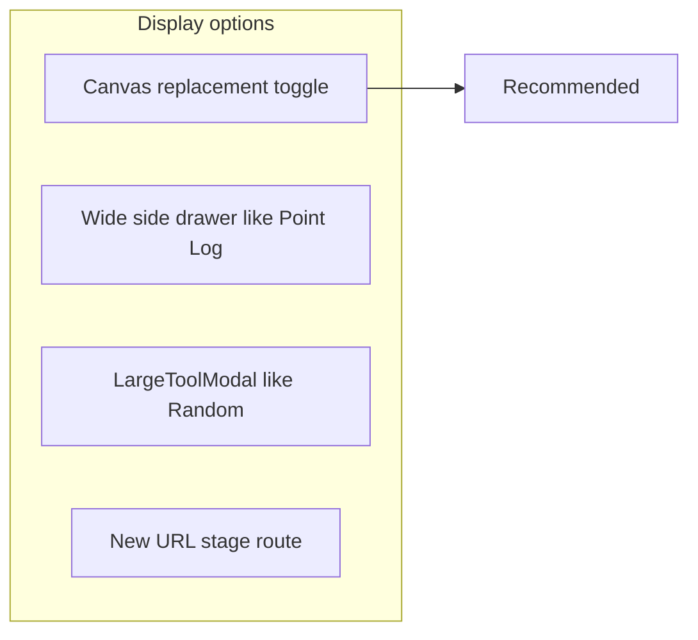
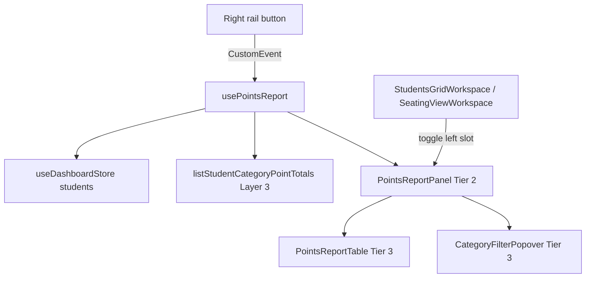

# Points Report — Planning Document

**Status:** Implemented (Phases 1–3).  
**Canonical references:** [`source-of-truth.md`](source-of-truth.md), [`architecture-plan.md`](architecture-plan.md), [`db-schema.md`](db-schema.md).

---

## 1. Feature summary

A **class points report** that lists every student in the active class as a table:

| Col | Field | Source |
|-----|-------|--------|
| 1 | Student Number | `students.student_number` |
| 2 | First Name | `students.first_name` |
| 3 | Last Name | `students.last_name` |
| 4 | Gender | `students.gender` (`Boy` / `Girl` / empty) |
| 5 | Points | See §3 |

**Default (Points col):** each student's **total** points (`students.points` — already denormalized and in `useDashboardStore`).

**Filtered (Points col):** net points for one or more **category names**, with positive and negative skills that share the same display name consolidated into a single filter bucket (e.g. positive "Homework" + negative "Homework" → one "Homework" filter; net = sum of all `point_events.points` for both category IDs).

**Nice-to-have:** multi-category selection via a small popup (checkbox list or chip picker); Points column shows the **sum** of selected categories per student.

**Out of scope for v1 (defer):** export CSV/PDF, date ranges, custom-point-event breakdown by memo, printing.

---

## 2. Display approach — recommendation

### Options considered



| Approach | Pros | Cons |
|----------|------|------|
| **A. Canvas replacement toggle** (recommended) | Keeps full dashboard chrome; uses full canvas width; mirrors Point Log toggle-from-rail pattern; no new route; easy return to grid/seating | Grid hidden while open (same as Point Log drawer) |
| B. Wide side drawer | Reuses `PointsLogDrawer` positioning pattern | Max ~720px width — tight for 5 columns; scroll-heavy |
| C. `LargeToolModal` (Random pattern) | Lots of room; isolated UI | Feels like a "tool" not a report; adds `useLayoutStore` flag + `DashboardToolsHost` wiring; dims entire workspace |
| D. New `activeView` / URL segment | Bookmarkable | Overkill; conflicts with URL-as-truth for grid/seating; largest implementation cost |

### Recommendation: **workspace canvas replacement (toggle panel)**

When the report is open, the **left column** of `StageTwoColumnSplit` (where `StudentsCardsGrid` or `SeatingGroupsCanvas` normally renders) shows the report table instead. Shell chrome (left nav, top bar, bottom nav, right rail) stays unchanged.

This is the best balance of:

- **Easier than Random** — no portal, no `DashboardToolsHost`, no 90vw modal shell
- **Better than Point Log drawer** — full canvas width for a 5-column table
- **Matches user intuition** — "same workspace, different content" rather than a floating tool

**Close behavior:** same rail button toggles off (icon active state like Point Log / Teacher's View); optionally close on class change via existing `key={classId}` remount in `src/features/dashboard/DashboardView.tsx`.

**Mutual exclusion:** when report opens, close Point Log drawer if open (and vice versa) to avoid stacked overlays.

---

## 3. Points column — data rules

### 3.1 Default: total points

Read `student.points` from `src/features/dashboard/stores/useDashboardStore.ts`. No extra fetch on open (roster already synced by `DashboardStudentSync`).

Sort default: student number ascending — reuse logic from `src/features/students/stores/dashboardStudentSelectors.ts` (`sortBy === 'number'`).

### 3.2 Category-filtered points

**Problem today:** app has no per-student-per-category aggregation (`src/hooks/useClassPointLog.ts` is event-level only).

**New Layer 3 API** (e.g. in `src/features/dashboard/lib/api/points.ts`):

```
listStudentCategoryPointTotals({
  studentIds: string[],
  categoryNameKeys?: string[],  // normalized names; omit = all categories
}) → Map<studentId, number>
```

Query `point_events` joined to `point_categories` for the class; `SUM(points)` grouped by `student_id` (+ filter by consolidated category names).

**Category consolidation rule:**

- Build a **display catalog** from non-archived `point_categories` for the class.
- Group rows by `name.trim().toLowerCase()` for the filter UI (one checkbox/option per unique name).
- When filtering, include **all category IDs** that share that normalized name (both `type: 'positive'` and `type: 'negative'`).
- Net points = algebraic sum (e.g. +8 and −3 under "Homework" → **5**).

**Custom awards (`custom_point_events`):**

- Included in **total** (`students.points` already reflects them).
- **Excluded** from named category filters (no `category_id`). v1: show helper text when filtered — *"Custom points are included in Total only."*
- Nice-to-have later: add a **"Custom"** pseudo-category in the multi-select popup.

### 3.3 Multi-category (nice-to-have)

Popup lists consolidated category names (checkboxes). Points column = sum of net totals for all selected names. If none selected, fall back to **Total**.

UI sketch: header row above table — `Points: [Total ▾]` dropdown or filter button opening `CategoryFilterPopover` (Tier 3); selected chips shown inline.

---

## 4. Entry point — right rail button

Wire through the existing toolbar pipeline:

| Step | File |
|------|------|
| Add action id | `src/features/dashboard/stage/dashboardToolbarConfig.ts` — extend `ToolbarActionId` with `'points-report'` |
| Insert in `bottomActions` | **Above** Teacher's View and Point Log: `[points-report, teacher-view, point-log]` (first = closest to spacer / top of bottom group) |
| Icon + event | `src/features/dashboard/stage/workspaceToolbarPresets.tsx` |
| Event constant | `src/lib/events/students.ts` — e.g. `STAGE_TOGGLE_POINTS_REPORT` |
| Listener | `src/features/students/hooks/useStudentsToolbarEvents.ts` (grid) + `src/features/seating/hooks/useSeatingLayoutManager.ts` (seating view) — same pattern as Point Log |

**Availability:**

- **Enabled** on student grid and seating view (class context required — same as Point Log).
- **Disabled** on classes-only dashboard (`/dashboard` without class) and seating editor mode (`isEditMode` → `bottomActions: []` already).

**New icon:** `CanvasPointsReportIcon.tsx` under `src/components/ui/icons/` (mirror `CanvasPointsLogIcon` style).

---

## 5. Architecture (3-tier / 3-layer)



| Layer | Responsibility | Location |
|-------|----------------|----------|
| **Layer 3** | Supabase queries: categories catalog + aggregated totals | `src/features/dashboard/lib/api/points.ts` (or `pointsReport.ts`) |
| **Layer 1** | `usePointsReport(classId)` — open state, filter state, fetch on filter change, derive table rows | `src/hooks/usePointsReport.ts` |
| **Tier 2** | `PointsReportPanel` — composes filter + table, loading/error | `src/features/dashboard/PointsReportPanel.tsx` or `src/features/students/PointsReportPanel.tsx` |
| **Tier 3** | `PointsReportTable`, `CategoryFilterPopover` — props only | `src/features/dashboard/components/points-report/` |
| **Tier 2 workspace** | Conditional render in left slot of `StageTwoColumnSplit` | `src/features/students/StudentsGridWorkspace.tsx`, `src/features/seating/SeatingViewWorkspace.tsx` |

**No Zustand** for report state in v1 — local hook state (same as `useClassPointLog`). Categories fetched on first open / filter interaction, not global store.

---

## 6. UI spec (Tier 3 table)

**Layout:** full-height scrollable table inside canvas (`min-h-0 flex-1 overflow-auto`).

**Header row (sticky):** `# | First Name | Last Name | Gender | Points`

**Rows:** one per student, sorted by student number (nulls last).

**Points cell:**

- Default: integer, color-coded optional (positive green / negative red / zero gray) — match `src/features/students/components/cards/StudentCard.tsx` badge conventions if any.
- Filtered: same formatting; header shows active filter label e.g. `Points (Homework)` or `Points (Homework, Participation)`.

**Empty states:** no students → "No students in this class"; loading → skeleton or spinner row.

**Toolbar header inside panel:** title "Points Report" + active filter summary; no separate close button required if rail toggles (optional X for discoverability).

---

## 7. Implementation phases

### Phase 1 — MVP (ship first)

1. Right-rail button + toggle event wiring
2. `usePointsReport` with open/close state
3. Canvas replacement in grid + seating workspaces
4. `PointsReportTable` with total points only (columns 1–5)
5. Layer 3 fetch for category catalog (prep for Phase 2)

### Phase 2 — Single-category filter

1. `listStudentCategoryPointTotals` aggregation API
2. Category dropdown (consolidated names)
3. Points column switches between Total and selected category net

### Phase 3 — Nice-to-have

1. Multi-category popup with checkboxes + chip display
2. Optional "Custom" pseudo-category
3. Column sort (click header to sort by points / name)
4. Update `docs/teacher-workflows.md` with WF-XX workflow

---

## 8. Scope & docs touchpoints

- `docs/project-scope.md` §3 currently lists *"Reporting / analytics beyond points log drawer"* as out of scope — **update when implementing** to include this report as in-scope.
- Add workflow entry to `docs/teacher-workflows.md` parallel to WF-62 (Point log).
- No `src/app/` route changes required.

---

## 9. Open questions (resolve before Phase 2)

1. **Seating editor:** hide report button entirely in edit mode, or show disabled? (Recommend: hidden — `bottomActions: []` in edit mode already.)
2. **Gender display:** raw DB value (`Boy`/`Girl`) or friendly labels?
3. **Filtered view with zero events:** show `0` or `—`?
4. **Realtime:** refresh report totals on `broadcastStudentPointsUpdate` while open? (Recommend: yes for Total mode; refetch aggregation on award for filtered mode.)

---

## 10. Why not Random-style modal?

`src/features/dashboard/tools/Random.tsx` is the right pattern for **transient interactive tools** (pick → award → close). A points report is a **read-only data view** tied to the class workspace — same category as Point Log. Canvas replacement reuses the proven rail-toggle pattern with more horizontal space and less wiring than adding `isPointsReportOpen` to `src/stores/useLayoutStore.ts` + `src/features/dashboard/DashboardToolsHost.tsx`.
