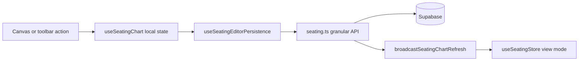

# Seating Editor Persistence Audit

**Last updated:** post immediate-persistence implementation (2026).

Reference for how the seating **editor** persists changes: which state buckets exist, what writes to Supabase, and how view mode stays in sync.

Primary files:

- [`src/hooks/useSeatingChart.ts`](../src/hooks/useSeatingChart.ts) — editor orchestration, optimistic local state, wires persistence
- [`src/hooks/useSeatingEditorPersistence.ts`](../src/hooks/useSeatingEditorPersistence.ts) — Layer 1 targeted persist + rollback
- [`src/features/seating/lib/api/seating.ts`](../src/features/seating/lib/api/seating.ts) — Layer 3 Supabase access
- [`src/hooks/useSeatingEditorToolbarActions.ts`](../src/hooks/useSeatingEditorToolbarActions.ts) — view-setting toggles
- [`src/features/seating/stores/useSeatingStore.ts`](../src/features/seating/stores/useSeatingStore.ts) — shared desk (view mode + editor chrome)
- [`src/features/dashboard/hooks/sync/SeatingChartDataSync.tsx`](../src/features/dashboard/hooks/sync/SeatingChartDataSync.tsx) — layout/group/view-settings hydration

---

## Architecture (editor mutation flow)

**Pattern:** optimistic local update → targeted API call → on failure rollback local state + error toast. **`group_rows`** is recomputed from assignments and written via `updateSeatingGroupRows` after assignment-affecting changes.

**Exit (toolbar X):** navigate only — removes `mode=edit`, emits edit-mode false, calls `refreshSeatingGroupsForLayout` so view mode hydrates from DB. **No batch save on exit.**

---

## State buckets

| Bucket | Location | Used by |
|--------|----------|---------|
| Groups list | `useSeatingChart` local `groups` | Editor canvas |
| Seat assignments | `useSeatingChart` local `groupAssignments` (Map) | Editor canvas |
| Group XY positions | `useSeatingChart` local `groupPositions` (Map) | Editor canvas |
| Unseated roster | `useSeatingStore.unseatedStudents` | Left nav |
| Selected student for placement | `useSeatingStore.selectedStudentForGroup` | Left nav + canvas |
| Color toggles | `useSeatingStore` (`colorByGender`, `colorByLevel`) | Editor canvas, left nav, view canvas |
| Grid / furniture / desk orientation | **Split:** toolbar local state + `useSeatingChart` local decor mirror; store also holds copies for view mode | Toolbar menu, `SeatingCanvasDecor`, view workspace |
| View-mode canvas data | `useSeatingStore` (`groups`, `groupAssignmentsById`, `groupPositionsById`) | View mode only; refreshed via broadcast / exit refresh / sync workers — **not** updated on every editor optimistic edit |

---

## Persistence inventory

Legend: **Local hook** = `useSeatingChart` · **Store** = `useSeatingStore` · **DB** = Supabase via `seating.ts`

### View preferences (toolbar)

| Change | Local hook | Store | DB | Notes |
|--------|:----------:|:-----:|:--:|-------|
| Show grid | Yes (decor) | Yes | **Immediate** | `updateLayoutViewSettings` + `syncLayoutViewSettings` + `SEATING_VIEW_SETTINGS_CHANGED` event; hook syncs decor via event/fetch |
| Show furniture | Yes (decor) | Yes | **Immediate** | Same |
| Teacher's desk left/right | Yes (decor) | Yes | **Immediate** | Same |
| Color by gender | No | Yes | **Immediate** | Canvas / left nav read store; toolbar syncs store on load and toggle |
| Color by level | No | Yes | **Immediate** | Same |

**Store hydration on load:** `SeatingChartDataSync` calls `refreshLayoutViewSettings` when `selectedLayoutId` changes; editor toolbar initial fetch also calls `syncLayoutViewSettings`.

### Group structure (create / edit / delete)

| Change | Local hook | Store | DB | Notes |
|--------|:----------:|:-----:|:--:|-------|
| Add one group | Yes (via `fetchGroups`) | No | **Immediate** | `insertSeatingGroup` |
| Add multiple groups | Yes (via `fetchGroups`) | No | **Immediate** | `insertSeatingGroups` |
| Edit group (modal: name, columns) | Yes | No | **Immediate** | `updateSeatingGroupFields` |
| Inline rename group | Yes | No | **Immediate** | `updateSeatingGroupFields` |
| Update group columns (settings menu) | Yes | No | **Immediate** | `updateSeatingGroupFields` (columns only; see concerns) |
| Delete one team | Yes | No | **Immediate** | `deleteTeamAssignmentsAndGroup` |
| Clear one team (unseat) | Yes | Yes (unseated) | **Immediate** | `deleteStudentSeatAssignmentsForSeatingGroupId` + `syncGroupRowsForGroupIds` |
| Clear all groups | Yes | Yes (unseated) | **Immediate** | `deleteAssignmentsForGroupsSequential` + `syncGroupRowsForGroupIds` |
| Delete all groups | Yes | Yes (unseated) | **Immediate** | Assignments delete + `deleteSeatingGroupsSequential` |

### Layout geometry and seating (canvas — immediate granular persist)

| Change | Local hook | Store | DB | Layer 3 / orchestrator |
|--------|:----------:|:-----:|:--:|------------------------|
| Drag group XY | Yes | No | **Immediate** | `updateSeatingGroupPosition` |
| Add student to group | Yes | Yes (unseated) | **Immediate** | `insertStudentSeatAssignment` + `updateSeatingGroupRows` |
| Remove student from group | Yes | Yes (unseated) | **Immediate** | `deleteStudentSeatAssignmentsByStudentId` + `updateSeatingGroupRows` |
| Swap students (same or cross group) | Yes | No | **Immediate** | `swapSeatAssignments` (delete both + insert both) + `updateSeatingGroupRows` |
| Move student cross-group | Yes | No | **Immediate** | `deleteStudentSeatAssignmentsByStudentId` + `insertStudentSeatAssignment` + `updateSeatingGroupRows` |
| Move / change seat within same group | Yes | No | **Immediate** | `updateStudentSeatAssignmentByStudentId` (+ `fallbackGroupId` upsert if no DB row) + `updateSeatingGroupRows` |
| `group_rows` (derived) | Yes (computed in hook) | No | **Immediate** | `updateSeatingGroupRows` after assignment changes; local `groups[].group_rows` patched on success |

Orchestration lives in [`useSeatingEditorPersistence.ts`](../src/hooks/useSeatingEditorPersistence.ts). Failed persists roll back local assignments and show an error notification.

### Bulk seating tools

| Change | Local hook | Store | DB | Notes |
|--------|:----------:|:-----:|:--:|-------|
| Auto-assign seats | Yes (via `fetchGroups`) | Yes (unseated) | **Immediate** | Bulk `insertStudentSeatAssignments`; then `syncGroupRowsForGroupIds` per affected group |
| Randomize seats | Yes (via `fetchGroups`) | No | **Immediate** | Bulk delete all layout assignments + re-insert; then `syncGroupRowsForGroupIds` |

### UI / selection (not persisted)

| Change | Local hook | Store | DB |
|--------|:----------:|:-----:|:--:||
| Selected student for swap | Yes | No | No |
| Selected student for group placement | No | Yes | No |
| Group settings menu open state | Yes | No | No |
| Drag-in-progress | Yes | No | No |

### Exit (toolbar X)

| Action | DB write | Notes |
|--------|:--------:|-------|
| Close editor | **No** | URL `mode=edit` removed; `emitSeatingEditMode({ isEditMode: false })`; `refreshSeatingGroupsForLayout` for view hydration |
| Batch full replace | **Not wired** | `reconcileSeatingLayoutFullReplace` retained in `useSeatingChart` as internal recovery only (exported, no UI / no `SEATING_SAVE` listener) |

Editor UX copy: [`SeatingCanvasDecor`](../src/features/seating/components/canvas/SeatingCanvasDecor.tsx) shows **“Changes save automatically”** when `showSaveHint` is on.

---

## Layer 3 granular APIs (assignment / layout)

| Function | Used for |
|----------|----------|
| `updateSeatingGroupPosition` | Group drag drop |
| `updateSeatingGroupRows` | Derived row count after assignment changes |
| `insertStudentSeatAssignment` | Single placement, cross-group move, swap re-insert |
| `updateStudentSeatAssignmentByStudentId` | Same-group seat change; dedupes duplicate rows per student |
| `deleteStudentSeatAssignmentsByStudentId` | Removal, cross-group move, swap |
| `swapSeatAssignments` | Two-student swap (delete + insert both) |

Batch helpers (`updateSeatingGroupsLayoutBatch`, `deleteStudentSeatAssignmentsForGroupIds`, `insertStudentSeatAssignmentsBatched`) remain for **`reconcileSeatingLayoutFullReplace`**, randomize, and auto-assign.

All mutators broadcast via `broadcastByGroupIds` / `broadcastSeatingChartRefresh` for cross-tab view-mode refresh.

---

## View settings: dual hydration paths

| Path | When | What it updates |
|------|------|-----------------|
| `SeatingChartDataSync` → `refreshLayoutViewSettings` | `selectedLayoutId` changes (view **and** editor) | Store via `syncLayoutViewSettings` |
| `useSeatingLayoutManager` | View mode mounted | Same + realtime subscription |
| `useSeatingEditorToolbarActions` load effect | Editor toolbar mount | Toolbar local state **and** `syncLayoutViewSettings` |
| Toggle handlers | User toggles any view setting | DB + store + `SEATING_VIEW_SETTINGS_CHANGED` event |

Color-by-level borders in editor read **`useSeatingStore.colorByLevel`**, not toolbar local state alone.

---

## Related docs

- [`docs/archive/color_by_level_planning.md`](archive/color_by_level_planning.md) — color-by-level feature planning
- [`docs/architecture-plan.md`](architecture-plan.md) — Layer 1 / Layer 2 / Layer 3 boundaries
- [`docs/seat-index-logic.md`](seat-index-logic.md) — seat index math (`seatingLogic.ts`)

---

## Remaining concerns

1. **Two desks:** Editor canvas uses `useSeatingChart` local state; view mode uses `useSeatingStore`. View data catches up via broadcast and exit refresh, not live mirror of every editor pixel drag.

2. **Duplicate view-setting state:** Grid/furniture/desk exist in toolbar local state, hook decor state, and store. Color flags are store-canonical for rendering but toolbar still mirrors them locally. Consolidation would reduce drift risk.

3. **`group_columns` change without assignment change:** Updating columns via settings/modal writes `group_columns` only; **`group_rows` in DB may be stale** until a later assignment-affecting persist recalculates rows.

4. **No `UNIQUE(student_id)` on `student_seat_assignments`:** Legacy duplicate rows per student are possible. `updateStudentSeatAssignmentByStudentId` dedupes on update; cross-group move/swap use delete+insert to avoid ambiguity.

5. **`reconcileSeatingLayoutFullReplace` unwired:** Full delete-all + re-insert recovery exists but has no UI entry point; `SEATING_SAVE` event is still defined in [`students.ts`](../src/lib/events/students.ts) with no listener.

6. **`renumberSeatIndicesForGroup`:** Layer 3 API exists; editor exposes a callback but **no UI calls it** — seat holes are not auto-filled after manual edits.

7. **Exit refresh scope:** `handleClose` refreshes groups/assignments but does not explicitly call `refreshLayoutViewSettings` (usually already hydrated via `SeatingChartDataSync`).

8. **Failed persist UX:** Optimistic rollback + toast on API failure; teacher may need to retry the action. No offline queue.

9. **Layout manager drawer:** Rename/delete layout from drawer — persistence behavior documented elsewhere; not covered in this editor canvas inventory.
