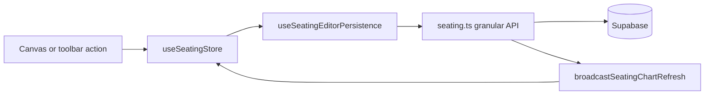

# Seating Editor Persistence Audit

**Last updated:** post Option C store unification, one-seat-per-layout constraint, manual layout repair, and repair-event cleanup (Sep 2026).

Reference for how the seating **editor** persists changes: which state buckets exist, what writes to Supabase, and how view mode stays in sync.

Primary files:

- [`src/hooks/useSeatingChart.ts`](../src/hooks/useSeatingChart.ts) — editor orchestration, reads/writes `useSeatingStore` for layout canvas data
- [`src/hooks/useSeatingEditorPersistence.ts`](../src/hooks/useSeatingEditorPersistence.ts) — Layer 1 targeted persist + rollback (store-backed)
- [`src/features/seating/lib/api/seating.ts`](../src/features/seating/lib/api/seating.ts) — Layer 3 Supabase access
- [`src/hooks/useSeatingEditorToolbarActions.ts`](../src/hooks/useSeatingEditorToolbarActions.ts) — view-setting toggles
- [`src/features/seating/stores/useSeatingStore.ts`](../src/features/seating/stores/useSeatingStore.ts) — **single desk** for groups, assignments, positions (editor + view)
- [`src/features/seating/stores/seatingLayoutStoreHelpers.ts`](../src/features/seating/stores/seatingLayoutStoreHelpers.ts) — Record/Map helpers, position builder
- [`src/features/dashboard/hooks/sync/SeatingChartDataSync.tsx`](../src/features/dashboard/hooks/sync/SeatingChartDataSync.tsx) — layout/group/view-settings hydration

---

## Architecture (editor mutation flow)

**Pattern:** optimistic store update → targeted API call → on failure rollback store slice + error toast. **`group_rows`** is recomputed from assignments and written via `updateSeatingGroupRows` after assignment-affecting changes.

**Exit (toolbar X):** navigate only — removes `mode=edit`, emits `SEATING_EDIT_MODE` false, calls `refreshSeatingGroupsForLayout` as a safety net. **`SeatingChartDataSync`** also listens for edit-mode exit and refreshes groups **again** plus view settings. **No batch save on exit.** See [Remaining concerns](#remaining-concerns) for duplicate-fetch and in-flight-persist risks.

---

## State buckets

| Bucket | Location | Used by |
|--------|----------|---------|
| Groups list | `useSeatingStore.groups` | Editor canvas + view canvas |
| Seat assignments | `useSeatingStore.groupAssignmentsById` (Record) | Editor canvas + view canvas |
| Group XY positions | `useSeatingStore.groupPositionsById` (Record) | Editor canvas + view canvas |
| Unseated roster | `useSeatingStore.unseatedStudents` | Left nav |
| Selected student for placement | `useSeatingStore.selectedStudentForGroup` | Left nav + canvas |
| Color toggles | `useSeatingStore` (`colorByGender`, `colorByLevel`) | Editor canvas, left nav, view canvas |
| Grid / furniture / desk orientation | **Split (not unified by Option C):** toolbar local state + `useSeatingChart` local decor mirror; store also holds copies for view mode | Toolbar menu reads local; editor canvas decor reads hook; view canvas reads store |

---

## Persistence inventory

Legend: **Store** = `useSeatingStore` · **DB** = Supabase via `seating.ts`

### View preferences (toolbar)

| Change | Local hook | Store | DB | Notes |
|--------|:----------:|:-----:|:--:|-------|
| Show grid | Yes (decor) | Yes | **Immediate** | `updateLayoutViewSettings` + `syncLayoutViewSettings` + `SEATING_VIEW_SETTINGS_CHANGED` event; hook syncs decor via event/fetch |
| Show furniture | Yes (decor) | Yes | **Immediate** | Same |
| Teacher's desk left/right | Yes (decor) | Yes | **Immediate** | Same |
| Color by gender | No | Yes | **Immediate** | Canvas / left nav read store; toolbar syncs store on load and toggle |
| Color by level | No | Yes | **Immediate** | Same |

**Store hydration on load:** `SeatingChartDataSync` calls `refreshLayoutViewSettings` when `selectedLayoutId` changes; editor toolbar initial fetch also calls `syncLayoutViewSettings`.

### Group structure (create / edit / delete)

| Change | Store | DB | Notes |
|--------|:-----:|:--:|-------|
| Add one group | Yes (via `fetchGroups`) | **Immediate** | `insertSeatingGroup` |
| Add multiple groups | Yes (via `fetchGroups`) | **Immediate** | `insertSeatingGroups` |
| Edit group (modal: name, columns) | Yes (after API) | **Immediate** | `updateSeatingGroupFields` via `persistGroupColumnsChange` — store patched on success, not optimistically |
| Inline rename group | Yes | **Immediate** | `updateSeatingGroupFields` (name only) |
| Update group columns (settings menu) | Yes (after API) | **Immediate** | Same as modal — `persistGroupColumnsChange` → columns + derived `group_rows` |
| Delete one team | Yes | **Immediate** | `deleteTeamAssignmentsAndGroup` |
| Clear one team (unseat) | Yes (+ unseated) | **Immediate** | `deleteStudentSeatAssignmentsForSeatingGroupId` + `syncGroupRowsForGroupIds` |
| Clear all groups | Yes (+ unseated) | **Immediate** | `deleteAssignmentsForGroupsSequential` + `syncGroupRowsForGroupIds` |
| Delete all groups | Yes (+ unseated) | **Immediate** | Assignments delete + `deleteSeatingGroupsSequential` |

### Layout geometry and seating (canvas — immediate granular persist)

| Change | Store | DB | Layer 3 / orchestrator |
|--------|:-----:|:--:|------------------------|
| Drag group XY | Yes | **Immediate** | `updateSeatingGroupPosition` |
| Add student to group | Yes (+ unseated) | **Immediate** | `insertStudentSeatAssignment` + `updateSeatingGroupRows` |
| Remove student from group | Yes (+ unseated) | **Immediate** | `deleteStudentSeatAssignmentsByStudentId` + `updateSeatingGroupRows` |
| Swap students (same or cross group) | Yes | **Immediate** | `swapSeatAssignments` (delete both + insert both) + `updateSeatingGroupRows` |
| Move student cross-group | Yes | **Immediate** | `deleteStudentSeatAssignmentsByStudentId` + `insertStudentSeatAssignment` + `updateSeatingGroupRows` |
| Move / change seat within same group | Yes | **Immediate** | `updateStudentSeatAssignmentByStudentId` (+ `fallbackGroupId` upsert if no DB row) + `updateSeatingGroupRows` |
| `group_rows` (derived) | Yes (computed + patched on store `groups`) | **Immediate** | `updateSeatingGroupRows` after assignment changes; also written with column changes via `persistGroupColumnsChange` |

Orchestration lives in [`useSeatingEditorPersistence.ts`](../src/hooks/useSeatingEditorPersistence.ts). Failed persists roll back store assignments and show an error notification.

### Bulk seating tools

| Change | Store | DB | Notes |
|--------|:-----:|:--:|-------|
| Auto-assign seats | Yes (via `fetchGroups`) | **Immediate** | Bulk `insertStudentSeatAssignments`; then `syncGroupRowsForGroupIds` per affected group |
| Randomize seats | Yes (via `fetchGroups`) | **Immediate** | Bulk delete all layout assignments + re-insert; then `syncGroupRowsForGroupIds` |

### UI / selection (not persisted)

| Change | Local hook | Store | DB |
|--------|:----------:|:-----:|:--:|
| Selected student for swap | Yes | No | No |
| Selected student for group placement | No | Yes | No |
| Group settings menu open state | Yes | No | No |
| Drag-in-progress | Yes | No | No |

### Exit (toolbar X) and manual repair

| Action | DB write | Notes |
|--------|:--------:|-------|
| Close editor | **No** | `handleClose`: URL `mode=edit` removed; `emitSeatingEditMode({ isEditMode: false })`; direct `refreshSeatingGroupsForLayout`. **`SeatingChartDataSync`** on the same event also calls `refreshSeatingGroupsForLayout` + `refreshLayoutViewSettings` — groups are fetched twice on every exit. |
| Manual layout repair | **Yes (full replace)** | Settings → **Sync layout to database** → confirmation → `SEATING_REPAIR_LAYOUT` → `repairSeatingLayoutFromStore`. Deletes all layout assignments and re-inserts from store; batch-updates group positions. |

**Repair guards:** Event handler blocks when `persistInFlightRef > 0`, randomize in flight, or repair already running (`saveAllChangesInFlightRef`). Toolbar disables the menu item while repair or randomize is in flight; granular persists are blocked at the handler with a “Please wait” toast (modal can still be opened during a granular persist).

Editor UX copy: [`SeatingCanvasDecor`](../src/features/seating/components/canvas/SeatingCanvasDecor.tsx) shows **“Changes save automatically”** when `showSaveHint` is on.

---

## Layer 3 granular APIs (assignment / layout)

| Function | Used for |
|----------|----------|
| `updateSeatingGroupPosition` | Group drag drop |
| `updateSeatingGroupRows` | Derived row count after assignment changes |
| `insertStudentSeatAssignment` | Single placement, cross-group move, swap re-insert; upserts on `(student_id, seating_chart_id)` |
| `updateStudentSeatAssignmentByStudentId` | Same-group seat change; scoped to one layout |
| `deleteStudentSeatAssignmentsByStudentId` | Removal, cross-group move, swap; optional layout scope (omit = all layouts, e.g. archive) |
| `swapSeatAssignments` | Two-student swap (layout-scoped delete + insert both) |

**DB invariant:** `UNIQUE(student_id, seating_chart_id)` on `student_seat_assignments` (migration `20250904000000_student_seat_assignments_layout_unique.sql`). Inserts enrich `seating_chart_id` from the target group; fetch dedupes defensively by student within a layout.

Batch helpers (`updateSeatingGroupsLayoutBatch`, `deleteStudentSeatAssignmentsForGroupIds`, `insertStudentSeatAssignmentsBatched`) remain for **`repairSeatingLayoutFromStore`** (manual recovery), randomize, and auto-assign.

All mutators broadcast via `broadcastByGroupIds` / `broadcastSeatingChartRefresh` for cross-tab view-mode refresh.

---

## View settings: multiple hydration paths

| Path | When | What it updates |
|------|------|-----------------|
| `SeatingChartDataSync` → `refreshLayoutViewSettings` | `selectedLayoutId` changes (view **and** editor) | Store via `syncLayoutViewSettings` |
| `SeatingChartDataSync` → `refreshLayoutViewSettings` | Edit mode exit (`SEATING_EDIT_MODE` false) | Store (safety net after editor close) |
| `useSeatingLayoutManager` | View mode mounted | Same + realtime subscription |
| `useSeatingEditorToolbarActions` load effect | Editor toolbar mount | Toolbar local state **and** `syncLayoutViewSettings` |
| `useSeatingChart` fetch + event/realtime/polling | Editor hook mount / layout change | Hook decor local state via `applyLayoutViewSettings` |
| Toggle handlers | User toggles any view setting | DB + store + `SEATING_VIEW_SETTINGS_CHANGED` event |

Color-by-level borders in editor read **`useSeatingStore.colorByLevel`**, not toolbar local state alone. Grid/furniture/desk in the **editor canvas** read **hook decor state**, while **view mode** reads the store — asymmetry noted below.

---

## Related docs

- [`docs/archive/color_by_level_planning.md`](archive/color_by_level_planning.md) — color-by-level feature planning
- [`docs/architecture-plan.md`](architecture-plan.md) — Layer 1 / Layer 2 / Layer 3 boundaries
- [`docs/seat-index-logic.md`](seat-index-logic.md) — seat index math (`seatingLogic.ts`)

---

## Resolved since prior audit

| Item | Status |
|------|--------|
| Groups / assignments / positions split between hook local state and store | **Resolved** — Option C: single desk in `useSeatingStore` for editor + view |
| Save-on-exit batch reconcile | **Resolved** — exit navigates only; immediate granular persist for normal edits |
| Duplicate seat assignments across layouts | **Resolved** — `UNIQUE(student_id, seating_chart_id)` + layout-scoped delete/update/upsert |
| `group_rows` missing on column-only change | **Resolved** — `persistGroupColumnsChange` writes columns + derived rows together |
| Unwired manual layout repair | **Resolved** — Settings → Sync layout → `SEATING_REPAIR_LAYOUT` |
| Misleading `SEATING_SAVE` event name | **Resolved** — renamed to `SEATING_REPAIR_LAYOUT`; deprecated `reconcileSeatingLayoutFullReplace` alias removed |

---

## Remaining concerns

### Still open (carried forward)

1. **Duplicate view-setting state (medium):** Grid/furniture/desk exist in toolbar local state, hook decor state, **and** store. Color flags are store-canonical for **card rendering** in the editor, but the toolbar menu still mirrors all five flags locally for toggle UI. Option C did not consolidate view settings. Events + sync hooks mitigate drift but three surfaces remain.

2. **`renumberSeatIndicesForGroup` unused (low):** Layer 3 API exists; hook exposes a callback but **no UI calls it** — seat index holes are not auto-filled after manual edits. The callback also does not refresh store assignments after renumber, so wiring it would need a follow-up fetch or store patch.

3. **Failed persist UX (low):** Optimistic rollback + error toast/modal on API failure; teacher must retry manually. No offline queue or auto-retry.

4. **Layout manager drawer (informational):** Rename/delete layout from drawer — persistence lives in `useSeatingLayoutManager`; not covered in this editor canvas inventory.

### Partially resolved

5. **Exit refresh scope (low):** `handleClose` still calls only `refreshSeatingGroupsForLayout`, but **`SeatingChartDataSync`** now refreshes view settings on edit-mode exit as well. Net: view settings are covered indirectly; groups are fetched **twice** on every exit (see #6).

### New concerns (from Option C + repair work)

6. **Exit refresh race with in-flight persist (medium):** Closing the editor while `persistInFlightRef > 0` can trigger DB fetches that overwrite optimistic store state with stale data. No guard delays exit refresh until granular persists finish.

7. **Editor vs view decor asymmetry (medium):** Editor canvas decor (grid/furniture/desk) reads hook local state; view canvas reads store. Color flags read store in both. Editor → view transition relies on exit refresh/event sync; brief inconsistency is possible if paths diverge.

8. **Redundant view-settings hydration (low):** Up to four independent fetch/sync paths can run on layout change or editor mount (`SeatingChartDataSync`, toolbar load, hook fetch, hook realtime/polling). Extra network; widens transient drift window before all paths converge.

9. **Column changes not optimistic (low):** `persistGroupColumnsChange` patches store **after** API success only (unlike seat/group-position edits). Column changes in the settings menu or edit-group modal feel laggy until the API returns.

10. **Repair UI guard incomplete (low):** Toolbar disables “Sync layout” during repair or randomize only. During granular persists the menu stays enabled; opening the confirmation modal succeeds but the event handler shows “Please wait”. Consider also disabling when `persistInFlightRef > 0`.

11. **Destructive repair blast radius (medium):** `repairSeatingLayoutFromStore` deletes **all** layout assignments then re-inserts from store. If store is stale (missed rollback notice, exit refresh race #6), repair writes stale state to DB and wipes divergent rows. Intended as recovery only; high blast radius.
