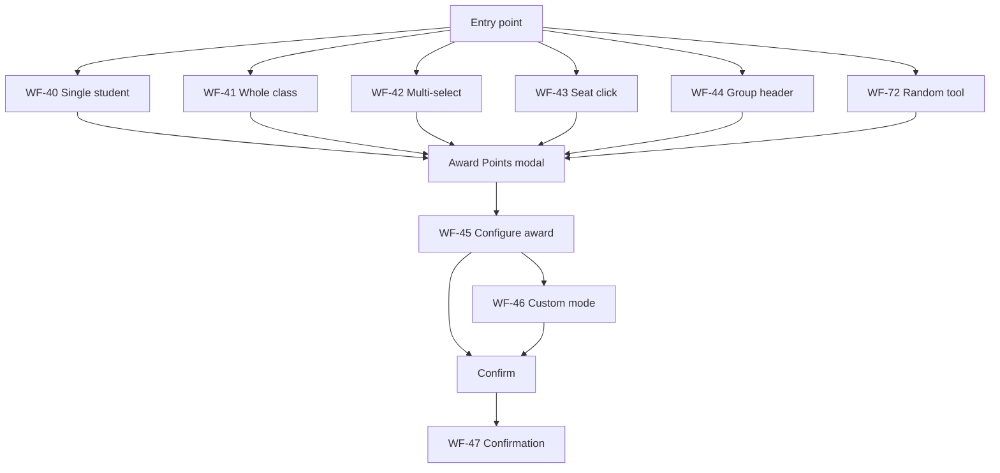
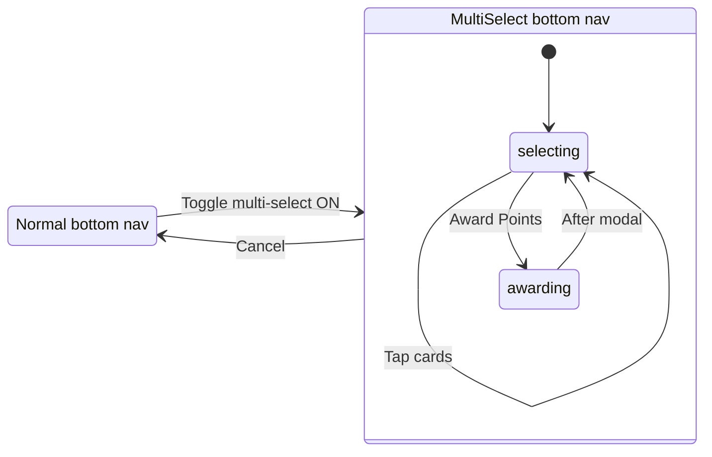

# KIS-Points — Teacher Workflows

**Last updated:** May 2026  
**Audience:** Classroom teachers, QA, onboarding developers  
**Companion docs:** [`product-spec.md`](product-spec.md) (expected behavior), [`project-scope.md`](project-scope.md) (in/out of scope), [`source-of-truth.md`](source-of-truth.md) (technical rules)

This document describes **step-by-step teacher workflows** — what to click, what happens, and what persists. It does not cover architecture or API design.

---

## How to read this doc

Each workflow has an ID (`WF-XX`) for cross-reference and QA scripts.

| Field | Meaning |
|-------|---------|
| **Goal** | What the teacher is trying to accomplish |
| **Preconditions** | Required state before starting |
| **Entry points** | Where in the UI the workflow begins |
| **Steps** | Ordered actions |
| **Outcome** | What changes on screen and in the database |
| **Edge cases** | Failures, empty states, restrictions |
| **Related** | Other workflow IDs |

---

## App map

### Shells and routes

| Shell | URLs | Purpose |
|-------|------|---------|
| Landing | `/` | Marketing entry; links to login/signup |
| Auth | `/login`, `/signup`, `/forgot-password`, `/reset-password` | Account access |
| Dashboard | `/dashboard`, `/dashboard/classes/[classId]` | Workspace |

### Dashboard chrome

| Zone | Location | Role |
|------|----------|------|
| Left nav | Persistent sidebar | Class list, active/archived toggle, websites menu |
| Top nav | Header | Class title, logo |
| Main stage | Center | Classes grid, students grid, or seating canvas |
| Right rail | Workspace toolbar | Context actions (point log, seating editor, layout manager) |
| Bottom nav | Footer | View, sort, multi-select, attendance, tools, settings |

On **seating edit mode**, left nav switches to layout list; bottom nav buttons are partially disabled.

### Global concepts

| Concept | Behavior |
|---------|----------|
| **Active vs archived classes** | Left nav toggles `viewMode`. Archived classes appear only in archived view. |
| **Class URL** | `/dashboard/classes/[classId]` — required for students/seating workflows. |
| **View query** | `?view=seating` = seating chart; default = student grid. |
| **Edit query** | `?view=seating&mode=edit` = seating editor. |
| **Preferred view** | Stored preference affects class card links (grid vs seating on open). |
| **Absent students** | Checked in attendance sheet. Macro awards (whole class, select-all, seating group batch) **exclude** absent. Manual single-student and explicit multi-select awards **include** absent (teacher override). |
| **Soft delete** | Archive class/student sets `is_archived`; records remain in database. |

---

## A. Account and entry

### WF-01: Sign up

**Goal:** Create a teacher account.  
**Preconditions:** None.  
**Entry points:** Landing `/` → Sign up link → `/signup`.

#### Steps

1. Open `/signup`.
2. Enter first name, last name, email, password, confirm password.
3. Submit the form.
4. Confirm email via Supabase message (if required by project config).
5. Proceed to WF-02.

#### Outcome

- New auth user and profile record created.
- Teacher can log in after email confirmation (when enabled).

#### Edge cases

- Validation errors shown inline on the form.
- Duplicate email rejected by Supabase.

#### Related

WF-02

---

### WF-02: Log in

**Goal:** Access the dashboard.  
**Preconditions:** Account exists.  
**Entry points:** `/login`, or redirect when session expired.

#### Steps

1. Enter email and password.
2. Submit.
3. On success, land on `/dashboard` (classes grid).

#### Outcome

- Session established; teacher profile loaded on dashboard.
- Classes list bootstraps in the background.

#### Edge cases

- Invalid credentials show an error on the form.
- Unauthenticated access to `/dashboard` redirects to login.

#### Related

WF-10, WF-04

---

### WF-03: Forgot and reset password

**Goal:** Recover account access.  
**Preconditions:** Registered email.  
**Entry points:** `/login` → Forgot password → `/forgot-password`.

#### Steps

1. Enter email on forgot-password form; submit reset request.
2. Open reset link from email → `/reset-password`.
3. Enter new password and confirm; submit.

#### Outcome

- Password updated in Supabase auth.
- Teacher can log in with new password (WF-02).

#### Edge cases

- Invalid or expired reset token shows form error.

#### Related

WF-02

---

### WF-04: Log out

**Goal:** End the session.  
**Preconditions:** Logged in; inside a class route (bottom settings available).  
**Entry points:** Bottom nav **Settings** (gear) → **Log out**.

#### Steps

1. Open a class (`/dashboard/classes/[classId]`) if not already there.
2. Tap **Settings** in bottom nav.
3. Choose **Log out**.

#### Outcome

- Session cleared; redirect to login or landing.

#### Edge cases

- Settings menu is only available when a class is open (`classId` in URL).

#### Related

WF-02

---

## B. Classes hub

### WF-10: View classes grid

**Goal:** See all accessible classes.  
**Preconditions:** Logged in.  
**Entry points:** `/dashboard` after login; left nav **Classes** area.

#### Steps

1. Navigate to `/dashboard`.
2. Review class cards (name, student count, icon).
3. Use right rail **Toggle point log** if needed (disabled on classes-only context for seating actions).

#### Outcome

- Grid shows classes filtered by active/archived mode (WF-11).
- Loading state while `allAccessibleClasses` fetches.

#### Edge cases

- Empty grid when teacher has no classes → use WF-12.
- Bottom **View** and **Sort** are disabled (no class context).

#### Related

WF-11, WF-12, WF-13

---

### WF-11: Toggle active vs archived classes

**Goal:** Switch between current and archived class lists.  
**Preconditions:** On `/dashboard`.  
**Entry points:** Left nav — **Active Classes** / **Archived Classes** buttons.

#### Steps

1. Click **Active Classes** to show non-archived classes.
2. Click **Archived Classes** to show archived classes (when any exist).

#### Outcome

- `viewMode` preference updates; grid re-filters.
- Archive/delete actions differ by view (WF-14, WF-15).

#### Edge cases

- Archived section hidden when no archived classes exist.

#### Related

WF-10, WF-14, WF-15

---

### WF-12: Create class

**Goal:** Add a new class.  
**Preconditions:** On `/dashboard`, active view.  
**Entry points:** **Add class** card at end of grid.

#### Steps

1. Click the add-class card.
2. In **Create Class** modal, enter name, grade, school year; pick icon.
3. Submit.

#### Outcome

- Class record created in Supabase.
- Class list refreshes; new card appears.

#### Edge cases

- Validation errors on required fields.
- API failure shows error in modal.

#### Related

WF-10, WF-13, WF-31

---

### WF-13: Open class

**Goal:** Work with a class roster.  
**Preconditions:** At least one class exists.  
**Entry points:** Class card click; left nav class link.

#### Steps

1. Click a class card or left nav entry.
2. Navigate to `/dashboard/classes/[classId]` (or `?view=seating` if preferred view is seating).
3. Students grid or seating view loads.

#### Outcome

- `activeClassId` syncs from URL; roster fetches.
- Bottom nav class tools enabled (view, sort, attendance, tools).

#### Edge cases

- Collaborator classes may have limited edit permissions.

#### Related

WF-30, WF-34, WF-60

---

### WF-14: Archive or restore class

**Goal:** Soft-delete or restore a class.  
**Preconditions:** Class visible in current view mode.  
**Entry points:** Class card **settings** menu (gear).

#### Steps

1. On class card, click gear icon (do not navigate into class).
2. Choose **Archive Class** (active view) or **Unarchive Class** (archived view).
3. Confirm in dialog.

#### Outcome

- `is_archived` toggled on class record.
- Class moves between active/archived lists after refresh.

#### Edge cases

- Non-owner collaborators may have restricted archive rights.

#### Related

WF-11, WF-15

---

### WF-15: Delete class

**Goal:** Permanently remove an archived class.  
**Preconditions:** Archived view; class is archived.  
**Entry points:** Class card menu → **Delete Class**.

#### Steps

1. Switch to archived classes (WF-11).
2. Open class card menu → **Delete Class**.
3. Confirm deletion.

#### Outcome

- Class and related data removed per backend rules.
- Card disappears from grid.

#### Edge cases

- Delete only offered in archived view (`showDelete`).

#### Related

WF-14

---

## C. Edit class modal

**Entry for WF-20–24:** Class card menu → **Edit Class**, or bottom **Settings** → **Edit Class** (when inside class).

### WF-20: Edit class info

**Goal:** Update class metadata.  
**Preconditions:** Class exists; edit modal open.  
**Entry points:** Edit Class modal → **Info** tab.

#### Steps

1. Open Edit Class modal.
2. Select **Info** tab.
3. Change name, grade, school year, or icon.
4. Save.

#### Outcome

- Class record updated; card and top nav title reflect changes.

#### Related

WF-13

---

### WF-21: Manage students in class (edit modal)

**Goal:** Add, edit, or archive students from class settings.  
**Preconditions:** Edit Class modal open.  
**Entry points:** **Students** tab.

#### Steps

1. Open **Students** tab.
2. Add students inline, edit fields, or archive/remove as provided.
3. Save changes per tab actions.

#### Outcome

- Roster updates; dashboard store refreshes on return to grid.

#### Related

WF-31, WF-32, WF-33

---

### WF-22: Manage collaborators

**Goal:** Add or remove co-teachers.  
**Preconditions:** Edit Class modal; Supabase `class_collaborators` migration applied.  
**Entry points:** **Teachers** tab.

#### Steps

1. Open **Teachers** tab.
2. Look up teacher by email; add or remove collaborators.
3. Save.

#### Outcome

- `class_collaborators` rows updated; collaborators gain class access.

#### Edge cases

- 404 errors if migration not applied — see [`supabase/README.md`](../supabase/README.md).

#### Related

WF-13

---

### WF-23: Class settings

**Goal:** Adjust class-level settings.  
**Preconditions:** Edit Class modal open.  
**Entry points:** **Settings** tab.

#### Steps

1. Open **Settings** tab.
2. Review or change available settings.
3. Save if applicable.

#### Outcome

- Settings persisted per class configuration.

#### Related

WF-24

---

### WF-24: Reset all class points

**Goal:** Zero out student point totals (optionally clear event history).  
**Preconditions:** Edit Class modal → **Settings** tab; user is primary owner.  
**Entry points:** **Reset Points** button.

#### Steps

1. Open **Settings** tab.
2. Click **Reset Points**.
3. Confirm in popup (choose whether to delete point events if prompted).
4. Wait for completion.

#### Outcome

- Student `points` fields reset; optional ledger cleanup.
- Grid and seating reflect new totals.

#### Edge cases

- Non-owners see disabled button or alert.

#### Related

WF-45, WF-62

---

## D. Students roster

### WF-30: View and sort students grid

**Goal:** Browse roster in preferred order.  
**Preconditions:** Inside class route; grid view (not seating).  
**Entry points:** `/dashboard/classes/[classId]`.

#### Steps

1. Open class (WF-13).
2. Review **Whole Class** card plus student cards.
3. Tap bottom **Sort** → choose sort option (e.g. name, points).
4. Sort preference persists across sessions.

#### Outcome

- Cards reorder; `sortBy` saved in preferences.

#### Related

WF-13, WF-41

---

### WF-31: Add students

**Goal:** Enroll new students in the class.  
**Preconditions:** Inside class; grid view.  
**Entry points:** **Add student** card; or modals from edit class.

#### Steps

1. Click **Add student** card (hidden during multi-select mode).
2. In **Add Students** modal, either:
   - Enter students one at a time, or
   - Paste bulk names (one per line; supports "First Last" or "Last, First").
3. Submit.

#### Outcome

- New `students` rows created; roster refreshes.
- Student numbers assigned per numbering rules.

#### Edge cases

- Duplicate or invalid names may show validation errors.

#### Related

WF-21

---

### WF-32: Edit student

**Goal:** Change student details.  
**Preconditions:** Student on roster.  
**Entry points:** Student card gear menu → **Edit Student**.

#### Steps

1. Open student card menu (gear).
2. Choose **Edit Student**.
3. Update first/last name, avatar, gender, student number.
4. Save.

#### Outcome

- Student record updated; card reflects changes.

#### Related

WF-33

---

### WF-33: Archive student

**Goal:** Remove student from active roster without deleting history.  
**Preconditions:** Student on roster.  
**Entry points:** Student card menu → delete/archive action.

#### Steps

1. Open student card menu.
2. Choose archive/delete (wording per UI).
3. Confirm.

#### Outcome

- `is_archived` set; student removed from active grid.
- Seat assignments cleared without renumbering other `seat_index` values.

#### Related

WF-65

---

### WF-34: Switch grid and seating view

**Goal:** Change main stage between student cards and seating chart.  
**Preconditions:** Inside class route.  
**Entry points:** Bottom nav **View** menu.

#### Steps

1. Tap **View** in bottom nav.
2. Choose **Student Grid** or **Seating Chart**.
3. URL updates (`?view=seating` or removed).

#### Outcome

- `activeView` and URL sync; appropriate workspace renders.
- Preferred view may persist to profile.

#### Edge cases

- View menu disabled on `/dashboard` without class.
- Seating with zero layouts shows empty/prompt state.

#### Related

WF-60, WF-63

---

## E. Point awards

> **UI upgrade (June 2026):** Select-then-confirm workflow, weight + category defaults, collapsed custom mode. See [`AwardPointsModal-UI-upgrade.md`](AwardPointsModal-UI-upgrade.md).

### Point award overview

| Entry | Modal mode | Absent excluded? |
|-------|------------|------------------|
| Student card click | `award_points_single` | No |
| Whole class card | `award_points_whole_class` | Yes |
| Multi-select trophy | `award_points_multi` | No |
| Seating seat click | `award_points_multi` (1 id) | No |
| Seating group header | `award_points_multi` (batch) | Yes |
| Random tool | Separate modal instance | N/A |

---

### WF-40: Award points to one student (grid)

**Goal:** Give points to a single student from the grid.  
**Preconditions:** Grid view; not in multi-select mode.  
**Entry points:** Click student card body (not gear menu).

#### Steps

1. Click the student card.
2. **Award Points** modal opens for that student.
3. Complete WF-45 or WF-46.
4. See WF-47 confirmation.

#### Outcome

- Points applied optimistically; persisted to `point_events` or `custom_point_events`.
- Card point total updates immediately.

#### Edge cases

- Absent students **can** receive points via this path (override).

#### Related

WF-45, WF-46, WF-47, WF-48

---

### WF-41: Award points to whole class

**Goal:** Apply same award to all present eligible students.  
**Preconditions:** Grid view.  
**Entry points:** Click **Whole Class** card (first card in grid).

#### Steps

1. Click **Whole Class** card.
2. Modal opens in whole-class mode (class name/icon shown).
3. Select skill or custom award (WF-45 / WF-46).
4. Confirm (WF-47).

#### Outcome

- All non-archived, **non-absent** students receive the award.
- Whole class point total on card updates.

#### Edge cases

- Alert if no eligible students (all absent or empty roster).
- Absent students excluded automatically.

#### Related

WF-50, WF-45, WF-47

---

### WF-42: Multi-select batch award

**Goal:** Award same points to manually selected students.  
**Preconditions:** Multi-select mode active (WF-80).  
**Entry points:** Multi-select footer **Award Points** (trophy).

#### Steps

1. Enter multi-select (WF-80).
2. Tap student cards to select.
3. Tap **Award Points** in footer.
4. Complete skill/custom in modal; confirm.

#### Outcome

- Selected student IDs receive award.
- **Absent students are not filtered** if manually selected.

#### Related

WF-80, WF-45, WF-47

---

### WF-43: Award points from seating (single seat)

**Goal:** Award one seated student.  
**Preconditions:** Seating view (`?view=seating`).  
**Entry points:** Click student seat on canvas.

#### Steps

1. Switch to seating view (WF-34).
2. Click a student's seat.
3. Award modal opens for that student.
4. Complete award flow.

#### Outcome

- Same as WF-40; seating canvas point display updates.

#### Related

WF-60, WF-40

---

### WF-44: Award points to seating group

**Goal:** Batch award all students in a group.  
**Preconditions:** Seating view; group has assigned students.  
**Entry points:** Click group header / award control on group.

#### Steps

1. In seating view, trigger award on a group (header click).
2. System collects student IDs in group.
3. Modal opens in multi-student mode.
4. Complete award; absent students excluded.

#### Outcome

- Present, non-absent students in group receive points.

#### Edge cases

- Alert if group empty or all absent.

#### Related

WF-50, WF-42

---

### WF-45: Configure and confirm skill award

**Goal:** Apply a predefined category with a chosen weight (+1…+10 or -1…-10).  
**Preconditions:** Award Points modal open.  
**Entry points:** Positive / Negative tab, weight row, category grid, **Confirm**.

#### Steps

1. Modal opens with defaults: **Positive** tab, **+1** weight, **General** category.
2. Optionally switch tab, weight, or category (skill card selects only; no instant submit).
3. Tap **Confirm**.
4. Confirmation follows (WF-47).

#### Outcome

- `point_events` row per target student; `points` column = weight; `category_id` = selected skill.

#### Related

WF-48, [`AwardPointsModal-UI-upgrade.md`](AwardPointsModal-UI-upgrade.md)

---

### WF-46: Award custom points

**Goal:** Ad-hoc points with optional memo.  
**Preconditions:** Award Points modal open.  
**Entry points:** **Award custom points** (expands modal; disables category grid).

#### Steps

1. Tap **Award custom points**.
2. Enter point value and optional memo (sign follows active tab).
3. Tap **Confirm** (or **Back to skills** to cancel custom mode).

#### Outcome

- `custom_point_events` recorded per target.

#### Related

WF-47, [`AwardPointsModal-UI-upgrade.md`](AwardPointsModal-UI-upgrade.md)

---

### WF-47: Post-award confirmation

**Goal:** Review what was just awarded.  
**Preconditions:** Award succeeded.  
**Entry points:** Automatic after award from dashboard modals or Random tool.

#### Steps

1. Read confirmation modal (student avatar, name, delta, skill icon).
2. Dismiss confirmation.

#### Outcome

- UI only; no additional persistence.

#### Related

WF-40–46, WF-72

---

### WF-48: Manage skills from award modal

**Goal:** Add, edit, or delete point categories.  
**Preconditions:** Award Points modal open.  
**Entry points:** **Manage skills** / edit skills entry in modal.

#### Steps

1. Open manage skills from award modal.
2. **Edit Skills** modal lists categories.
3. Add skill (WF-48a): name, type (from active tab), icon.
4. Edit skill (WF-48b): change name and icon; save.
5. Delete skill: remove category (soft archive).
6. Close; skill grid in award modal refreshes.

#### Outcome

- `point_categories` updated for class.
- New skills appear on next modal open.

#### Related

WF-45

---

## F. Attendance

### WF-50: Mark daily absences

**Goal:** Record who is absent today.  
**Preconditions:** Inside class route.  
**Entry points:** Bottom nav **Attendance**.

#### Steps

1. Tap **Attendance**.
2. Bottom sheet opens with roster checkboxes.
3. Check students who are **absent** (checked = absent).
4. Toggle as needed; changes save per toggle.
5. Close sheet by tapping outside or attendance button again.

#### Outcome

- `attendance_events` row added/removed for today.
- `absentStudentIds` in store updates.
- Macro awards (WF-41, WF-44, select-all in WF-80) respect absences.

#### Edge cases

- Switching classes clears and re-fetches today's absences for new class.
- Date uses UTC calendar day in API.

#### Related

WF-41, WF-44, WF-80

---

## G. Seating

### Seating lifecycle

---

### WF-60: View seating chart

**Goal:** See current layout and seat assignments.  
**Preconditions:** Class has at least one layout (or empty state).  
**Entry points:** WF-34 → Seating Chart.

#### Steps

1. Switch to seating view.
2. Active layout renders groups and student seats.
3. Pan/zoom as supported by canvas.

#### Outcome

- Read-only view of `seating_charts`, `seating_groups`, `student_seat_assignments`.

#### Edge cases

- No layouts: prompt to create (WF-64).

#### Related

WF-34, WF-63

---

### WF-61: Teacher's view

**Goal:** Toggle teacher-focused seating display.  
**Preconditions:** Seating view.  
**Entry points:** Right rail toolbar → **Teacher's view**.

#### Steps

1. In seating view, click **Teacher's view** on workspace toolbar.
2. View settings apply per seating store configuration.

#### Outcome

- Canvas display updates; settings may persist for layout.

#### Related

WF-60

---

### WF-62: Open point log

**Goal:** Review recent point events for the class.  
**Preconditions:** Inside class (grid or seating).  
**Entry points:** Right rail **Toggle point log**.

#### Steps

1. Click point log icon on workspace toolbar.
2. Drawer opens with paginated log.
3. Change page or rows per page as needed.
4. Close drawer via toggle or click outside.

#### Outcome

- Read-only view of point history from API.

#### Related

WF-45, WF-46

---

### WF-63: Enter seating editor

**Goal:** Modify layouts, groups, and assignments.  
**Preconditions:** Seating view; at least one layout exists.  
**Entry points:** Right rail **Seating Editor View**.

#### Steps

1. In seating view, click **Seating Editor** (or equivalent toolbar label).
2. URL gains `?mode=edit`.
3. Left nav switches to layout list; editor toolbar appears.
4. Bottom nav buttons partially disabled.

#### Outcome

- `isEditMode` true; editor workspace active.

#### Edge cases

- Disabled when `seatingLayoutsCount === 0`.

#### Related

WF-65, WF-66

---

### WF-64: Create and manage layouts

**Goal:** Add or switch seating layouts.  
**Preconditions:** Seating view or editor.  
**Entry points:** Toolbar **Create new layout**; **Layout manager**.

#### Steps

1. **Create:** Open create layout modal; enter name; submit.
2. **Layout manager:** Open drawer; select active layout, rename, or delete.
3. Active layout drives which groups load on canvas.

#### Outcome

- `seating_charts` CRUD; groups refetch for selected layout.

#### Related

WF-63, WF-65

---

### WF-65: Edit groups and assign seats

**Goal:** Arrange students in the seating editor.  
**Preconditions:** Seating editor active (WF-63).  
**Entry points:** Editor canvas and right rail menus.

#### Steps

1. Add groups via editor toolbar **Add Groups** menu.
2. Configure group rows/columns in group settings.
3. Drag students from roster onto seats.
4. Optional: **Auto-assign** or **Randomize** from toolbar menus.
5. Changes persist to `seating_groups` and `student_seat_assignments`.

#### Outcome

- Seat map updated; view mode reflects assignments after exit.

#### Edge cases

- Archiving a student removes their seat assignment.

#### Related

WF-33, WF-66

---

### WF-66: Exit seating editor

**Goal:** Return to read-only seating view.  
**Preconditions:** In editor (`?mode=edit`).  
**Entry points:** Editor toolbar **Close editor** (X).

#### Steps

1. Click **Close editor** on workspace toolbar.
2. `mode=edit` cleared from URL.
3. Standard left nav and bottom nav restore.

#### Outcome

- `isEditMode` false; `SeatingViewWorkspace` shown.

#### Related

WF-63, WF-60

---

## H. Classroom tools

### WF-70: Timer

**Goal:** Run a countdown timer in class.  
**Preconditions:** Inside class route.  
**Entry points:** Bottom nav **Timer**.

#### Steps

1. Tap **Timer**.
2. Movable panel opens (drag to reposition).
3. Set duration; start countdown.
4. On completion, end sound plays (`/sounds/timer-end-1.mp3`).
5. Close panel via X; optionally toggle **L** / **S** in the header — large mode grows **up-left** (bottom-right corner stays anchored above the bottom nav).

#### Outcome

- Local UI only; no database persistence.

#### Edge cases

- Opening Random may close Timer (mutually exclusive tool overlays).

#### Related

WF-72

---

### WF-71: Bells

**Goal:** Play bell sounds.  
**Preconditions:** Inside class route.  
**Entry points:** Bottom nav **Bells**.

#### Steps

1. Tap **Bells**.
2. Movable panel opens.
3. Trigger bell sounds from panel controls.
4. Close when done.

#### Outcome

- Audio only; no persistence.

#### Related

WF-71

---

### WF-73: Happy Meter

**Goal:** Log how the teacher is feeling during the day (local UI only).  
**Preconditions:** Inside class route.  
**Entry points:** Bottom nav **Happy Meter**.

#### Steps

1. Tap **Happy Meter** — movable panel opens above the bottom nav.
2. Use **−** / **+** to set mood on the gauge (needle moves across segments).
3. Optional: toggle **L** / **S** in the header for a larger or compact layout (panel grows up-left; bottom-right stays anchored).
4. Close via X when done.

#### Outcome

- Local UI only; no database persistence.

#### Related

WF-70, WF-71

---

### WF-72: Random student picker

**Goal:** Randomly select a student for participation or awards.  
**Preconditions:** Inside class route; roster loaded.  
**Entry points:** Bottom nav **Random**.

#### Steps

1. Tap **Random** — large modal opens.
2. Tap spin control; slot animation selects unpicked student.
3. Optional: **Award points** for selected student → award modal → WF-47.
4. Optional: award from points list sub-view in Random.
5. **Reset picked** clears `has_been_picked` for class roster.
6. Close modal.

#### Outcome

- `has_been_picked` updated on selected students.
- Points awards follow WF-40 path when used from Random.

#### Edge cases

- Absent students may be excluded from spin pool per random flow logic.
- Closing modal may require confirmation if spin in progress.

#### Related

WF-40, WF-47, WF-70

---

## I. Multi-select mode

### WF-80: Multi-select selection and award

**Goal:** Select multiple students for batch actions.  
**Preconditions:** Inside class; grid or seating with layouts.  
**Entry points:** Bottom nav checkbox (**Multi-select**).

#### Steps

1. Tap **Multi-select** to enable; footer swaps to multi-select bar.
2. Tap student cards to toggle selection (grid or seating).
3. Use footer shortcuts:
   - **Select All** (excludes absent)
   - **Select None**, **Inverse Select**
   - **Boys Only** / **Girls Only**
   - **Recently Selected** (from localStorage history)
4. Tap **Award Points** (trophy) when count &gt; 0 → WF-42.
5. Tap **Cancel** (X) to exit multi-select.

#### Outcome

- `isMultiSelectMode` toggled; `selectedStudentIds` tracked.
- Awards use explicit ID list (absent not auto-filtered).

#### Edge cases

- Disabled on classes grid (no class context).
- On seating view, disabled when zero layouts.
- Add student card hidden while multi-select active.

#### Related

WF-42, WF-50

---

## J. Cross-cutting chrome

### WF-90: Switch class via left nav

**Goal:** Change active class without returning to grid.  
**Preconditions:** Left nav visible.  
**Entry points:** Left nav class link.

#### Steps

1. Click another class in left nav.
2. Navigate to `/dashboard/classes/[newId]` preserving view query when applicable.

#### Outcome

- Roster, attendance, and seating reload for new class.

#### Related

WF-13

---

### WF-91: Bottom nav disabled states

**Goal:** Understand why controls are grayed out.  

| Context | Disabled controls |
|---------|-------------------|
| `/dashboard` (no class) | View, Sort, Multi-select, Attendance, class-specific tools |
| Seating editor | Most bottom nav actions (`buttonsDisabled`) |
| Seating view, 0 layouts | Multi-select may be disabled |

#### Related

WF-10, WF-63, WF-80

---

### WF-92: Empty states

| State | Location | Typical next step |
|-------|----------|-------------------|
| No classes | `/dashboard` | WF-12 |
| No students | Class grid | WF-31 |
| No seating layouts | Seating view | WF-64 |
| No eligible for award | Award modal | WF-50 or adjust selection |

---

## Appendix A: Workflow index

| ID | Summary |
|----|---------|
| WF-01 | Sign up |
| WF-02 | Log in |
| WF-03 | Forgot / reset password |
| WF-04 | Log out |
| WF-10 | View classes grid |
| WF-11 | Active vs archived classes |
| WF-12 | Create class |
| WF-13 | Open class |
| WF-14 | Archive / restore class |
| WF-15 | Delete class |
| WF-20 | Edit class info |
| WF-21 | Manage students in edit modal |
| WF-22 | Manage collaborators |
| WF-23 | Class settings tab |
| WF-24 | Reset class points |
| WF-30 | View / sort students grid |
| WF-31 | Add students |
| WF-32 | Edit student |
| WF-33 | Archive student |
| WF-34 | Switch grid ↔ seating |
| WF-40 | Award single student (grid) |
| WF-41 | Award whole class |
| WF-42 | Multi-select batch award |
| WF-43 | Award from seating seat |
| WF-44 | Award seating group |
| WF-45 | Award skill |
| WF-46 | Award custom points |
| WF-47 | Post-award confirmation |
| WF-48 | Manage skills |
| WF-50 | Mark attendance |
| WF-60 | View seating chart |
| WF-61 | Teacher's view |
| WF-62 | Point log drawer |
| WF-63 | Enter seating editor |
| WF-64 | Create / manage layouts |
| WF-65 | Edit groups and seats |
| WF-66 | Exit seating editor |
| WF-70 | Timer |
| WF-71 | Bells |
| WF-73 | Happy Meter |
| WF-72 | Random student picker |
| WF-80 | Multi-select mode |
| WF-90 | Switch class (left nav) |
| WF-91 | Bottom nav disabled states |
| WF-92 | Empty states |

---

## Appendix B: Modal types (`useModalStore`)

| Modal type | Workflow | Trigger |
|------------|----------|---------|
| `award_points_single` | WF-40, WF-43 | Student card or seat click |
| `award_points_whole_class` | WF-41 | Whole class card |
| `award_points_multi` | WF-42, WF-43, WF-44 | Multi-select, seat, or group |
| `edit_student` | WF-32 | Student card menu |
| `add_students` | WF-31 | Add student card |

Modals mount from `DashboardClassModalsHost` in the dashboard shell.

---

## Appendix C: Out of scope (Prototype 1)

Not documented as teacher workflows:

- AI teacher assistance (landing copy only)
- Parent / student portals
- Global account settings page
- Offline mode

See [`project-scope.md`](project-scope.md).
