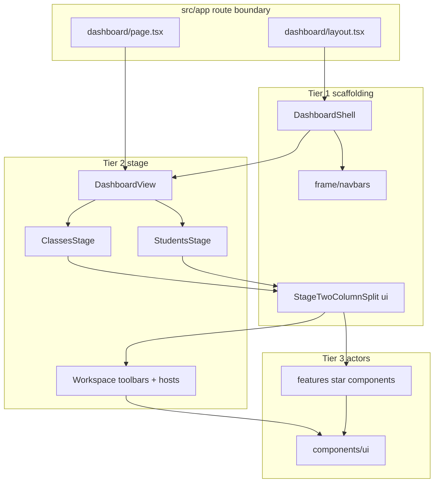

# Visual layer map (Prototype 1)

Canonical file tree for the **visual layer** only. For data flow, sync workers, URL rules, and modal patterns, see [`architecture-plan.md`](architecture-plan.md).

**Excluded (data layer):** `src/hooks/`, `src/lib/`, `src/stores/`

---

## Tier definitions

| Tier | Name | Role |
|------|------|------|
| **T1** | Scaffolding | Persistent **shells** and **frame chrome** (nav bars, 7-zone grid config, 2-column stage frame). Survives route changes within a shell. |
| **T2** | Stage | **View orchestration**: route entry, workspaces, content switches, toolbar orchestrators, modal/tool **hosts**, grids/canvas views, preset/config wiring. Subscribes to stores; passes props/callbacks to T3. |
| **T3** | Actors | **Presentational UI**: forms, cards, modals (body), menus, shared primitives, icons. Props in, callbacks out. |

**Route boundary** (`src/app/`): Next.js routing table only — imports shells/views; not T1/T2/T3 themselves.

**Visual foundation:** `src/styles/`, `src/assets/` (SVG sources mirrored by T3 icon components).

---

## Legend

- `[route]` = thin Next.js page/layout wire
- `[T1]` `[T2]` `[T3]` = visual tier

---

## How it fits together (dashboard)



---

## File tree

```
src/
├── app/                                    # ROUTE BOUNDARY (not a visual tier)
│   ├── layout.tsx                          [route] Root HTML/body; imports globals.css
│   ├── (landing)/
│   │   ├── layout.tsx                      [route] → LandingShell (T1)
│   │   └── page.tsx                        [route] → LandingView (T2)
│   ├── (auth)/
│   │   ├── layout.tsx                      [route] → AuthShell (T1)
│   │   ├── login/page.tsx                  [route] → LoginView (T2)
│   │   ├── signup/page.tsx                 [route] → SignUpView (T2)
│   │   ├── forgot-password/page.tsx        [route] → ForgotPasswordView (T2)
│   │   └── reset-password/page.tsx         [route] → ResetPasswordView (T2)
│   └── dashboard/
│       ├── layout.tsx                      [route] Suspense + DashboardShell (T1)
│       ├── page.tsx                        [route] → DashboardView (T2)
│       └── classes/[classId]/page.tsx      [route] → DashboardView (T2)
│
├── styles/
│   └── globals.css                         # Global tokens, Tailwind, brand styles
│
├── assets/icons/                           # SVG sources (mirrored by T3 icon components)
│   ├── Shared/
│   │   ├── AddPlusIcon.svg
│   │   └── EditPencilIcon.svg
│   └── WorkspaceToolbar/
│       ├── CanvasPointsLogIcon.svg
│       ├── CanvasTeachersViewIcon.svg
│       ├── EditorAddMultipleIcon.svg
│       ├── EditorAutoAssignSeatsIcon.svg
│       ├── EditorClearGroupsIcon.svg
│       ├── EditorRandomSeatsIcon.svg
│       └── EditorViewPreferencesIcon.svg
│
├── components/ui/                          # SHARED T3
│   ├── BaseBottomNav.tsx
│   ├── BaseCard.tsx
│   ├── BotNavGrayButton.tsx
│   ├── CardsGrid.tsx
│   ├── EmptyState.tsx
│   ├── ErrorState.tsx
│   ├── FormLabel.tsx
│   ├── InlineErrorText.tsx
│   ├── LargeToolModal.tsx
│   ├── LoadingState.tsx
│   ├── MovableToolPanel.tsx
│   ├── PasswordInput.tsx
│   ├── PrimaryButton.tsx
│   ├── ScaledGridFrame.tsx
│   ├── SelectInput.tsx
│   ├── StageTwoColumnSplit.tsx           # T3 twin-slot main + right rail (composed at T2 workspaces)
│   ├── TextInput.tsx
│   ├── WorkspaceToolbar.tsx              # T3 vertical toolbar shell (pill + slots)
│   ├── menu/
│   │   ├── MenuDivider.tsx
│   │   ├── MenuItem.tsx
│   │   ├── MenuLabel.tsx
│   │   └── MenuSurface.tsx
│   ├── modals/
│   │   ├── ConfirmationModal.tsx
│   │   ├── Modal.tsx
│   │   └── SuccessNotificationModal.tsx
│   └── icons/                            # React icon components (T3)
│       ├── AddPlusIcon.tsx
│       ├── CanvasPointsLogIcon.tsx
│       ├── CanvasTeachersViewIcon.tsx
│       ├── EditPencilIcon.tsx
│       ├── EditorAddMultipleIcon.tsx
│       ├── EditorAutoAssignSeatsIcon.tsx
│       ├── EditorClearGroupsIcon.tsx
│       ├── EditorRandomSeatsIcon.tsx
│       ├── EditorViewPreferencesIcon.tsx
│       ├── iconAddPlus.tsx
│       ├── iconAttendanceCheck.tsx
│       ├── iconAutoAssign.tsx
│       ├── iconCheckBox.tsx
│       ├── iconCheckCircle.tsx
│       ├── iconCircleX.tsx
│       ├── iconDocumentClock.tsx
│       ├── iconEditPencil.tsx
│       ├── iconEye.tsx
│       ├── iconNoCircleX.tsx
│       ├── iconPlus.tsx
│       ├── iconPresentationBoard.tsx
│       ├── iconRandomArrows.tsx
│       ├── iconSettingsWheel.tsx
│       ├── iconSortingArrows.tsx
│       ├── iconStarTrophy.tsx
│       ├── iconTimerClock.tsx
│       └── iconViewDots.tsx
│
└── features/
    │
    ├── landing/
    │   ├── layouts/
    │   │   └── LandingShell.tsx            [T1] Landing chrome wrapper
    │   ├── LandingView.tsx                 [T2] Composes landing sections
    │   └── components/                     [T3]
    │       ├── FeatureList.tsx
    │       ├── HeroTitle.tsx
    │       ├── LandingHeader.tsx
    │       ├── LandingLogo.tsx
    │       ├── LandingMascot.tsx
    │       └── LandingNavLink.tsx
    │
    ├── auth/
    │   ├── layouts/
    │   │   └── AuthShell.tsx               [T1] Centered auth chrome (flex layout)
    │   ├── LoginView.tsx                   [T2]
    │   ├── SignUpView.tsx                  [T2]
    │   ├── ForgotPasswordView.tsx          [T2]
    │   ├── ResetPasswordView.tsx           [T2]
    │   └── components/                     [T3]
    │       ├── AuthBackLink.tsx
    │       ├── AuthCard.tsx
    │       ├── AuthFormFooter.tsx
    │       ├── AuthFormHeader.tsx
    │       ├── AuthPrimaryButton.tsx
    │       └── forms/
    │           ├── ForgotPasswordForm.tsx
    │           ├── LoginForm.tsx
    │           ├── ResetPasswordForm.tsx
    │           └── SignupForm.tsx
    │
    ├── dashboard/
    │   ├── layouts/
    │   │   └── DashboardShell.tsx                [T1] 7-zone grid shell; navbars, hosts, {children}
    │   ├── DashboardView.tsx                     [T2] Route entry: activeView → Classes/Students workspace
    │   ├── DashboardClassModalsHost.tsx          [T2] Class create/edit modal orchestration mount
    │   ├── DashboardToolsHost.tsx                [T2] Timer + Random tool mount points
    │   ├── AwardPointsModalHost.tsx              [T2] Award-points flow host
    │   ├── EditSkillsModalHost.tsx               [T2] Edit-skills flow host
    │   ├── stage/                                [T2] Toolbar orchestration + config
    │   │   ├── dashboardToolbarConfig.ts         [T2] Action IDs / disabled rules (visual contract)
    │   │   ├── workspaceToolbarPresets.tsx       [T2] Preset icons + events → WorkspaceToolbarAction
    │   │   └── DashboardWorkspaceToolbar.tsx     [T2] Default workspace rail (uses T3 WorkspaceToolbar)
    │   ├── tools/
    │   │   └── Random.tsx                        [T2] Random picker tool (LargeToolModal)
    │   └── components/
    │       ├── frame/                            [T1] Dashboard frame only
    │       │   ├── dashboardZoneConfig.ts        [T1] Grid row/col class names for 7 zones
    │       │   └── navbars/                      [T1]
    │       │       ├── LeftNav.tsx
    │       │       ├── SeatingEditorLeftNav.tsx
    │       │       ├── TopNav.tsx
    │       │       ├── BottomNav.tsx
    │       │       └── MultiSelectBottomNav.tsx
    │       ├── tools/
    │       │   └── Timer.tsx                     [T3] Timer panel body (opened by T2 host)
    │       ├── PointsLogDrawer.tsx               [T3]
    │       ├── cards/                            [T3]
    │       │   ├── EditSkillCard.tsx
    │       │   ├── SkillActionCard.tsx
    │       │   └── SkillCard.tsx
    │       ├── forms/                            [T3] Strict: no orchestration hooks
    │       │   ├── AddSkillForm.tsx
    │       │   └── EditSkillForm.tsx
    │       ├── menus/                            [T3]
    │       │   └── LeftNavWebsitesMenu.tsx
    │       └── modals/                           [T3] Presentational; hosts supply wiring
    │           ├── AddSkillModal.tsx
    │           ├── AwardPointsModal.tsx
    │           ├── EditSkillModal.tsx
    │           ├── EditSkillsModal.tsx
    │           └── PointsAwardedConfirmationModal.tsx
    │
    ├── classes/
    │   ├── ClassesStage.tsx                  [T2] Stage entry → content
    │   ├── ClassesStageContent.tsx           [T2] Modals + delegates to grid branch
    │   ├── ClassesGridBranch.tsx             [T2] Grid branch router
    │   ├── ClassesGridWorkspace.tsx          [T2] Split + grid + disabled rail
    │   ├── ClassesGridWorkspaceToolbar.tsx   [T2] Classes right rail (disabled on /dashboard)
    │   ├── ClassCardsGrid.tsx                    [T2] Grid orchestration (ScaledGridFrame + CardsGrid)
    │   ├── EditClassModalRoot.tsx                [T2] Edit-class modal subtree root
    │   └── components/
    │       ├── cards/                            [T3] ClassCard: narrow viewPreference store read
    │       │   ├── AddClassCard.tsx
    │       │   └── ClassCard.tsx
    │       ├── forms/                            [T3]
    │       │   ├── CreateClassForm.tsx
    │       │   └── edit-class/
    │       │       ├── EditClassInfoTab.tsx
    │       │       ├── EditClassModalTabs.tsx
    │       │       ├── EditClassResetPointsDialog.tsx
    │       │       ├── EditClassSettingsTab.tsx
    │       │       ├── EditClassStudentsTab.tsx
    │       │       └── EditClassTeachersTab.tsx
    │       ├── menus/                            [T3]
    │       │   └── ClassCardActionsMenu.tsx
    │       └── modals/                           [T3 façade + T3 bodies]
    │           ├── CreateClassModal.tsx
    │           └── EditClassModal.tsx            # thin re-export → EditClassModalRoot (T2)
    │
    ├── students/
    │   ├── StudentsStage.tsx                 [T2] Stage entry → content
    │   ├── StudentsStageContent.tsx          [T2] Grid vs seating routing; shared hooks/modals
    │   ├── StudentsGridBranch.tsx              [T2] Grid branch router
    │   ├── StudentsGridWorkspace.tsx           [T2] Split + grid + point log + rail
    │   ├── StudentsGridWorkspaceToolbar.tsx    [T2] Grid workspace rail
    │   ├── StudentsCardsGrid.tsx               [T2] Student grid layout
    │   └── components/
    │       ├── cards/                            [T3] StudentCard: useShallow store exception
    │       │   ├── AddStudentCard.tsx
    │       │   ├── StudentCard.tsx
    │       │   └── WholeClassCard.tsx
    │       ├── forms/                            [T3]
    │       │   ├── AddStudentsForm.tsx
    │       │   └── EditStudentForm.tsx
    │       ├── menus/                            [T3]
    │       │   ├── AttendanceMenuBody.tsx
    │       │   ├── StudentCardActionsMenu.tsx
    │       │   ├── StudentsSettingsMenu.tsx
    │       │   ├── StudentsSortingMenu.tsx
    │       │   └── StudentsViewMenu.tsx
    │       └── modals/                           [T3]
    │           ├── AddStudentsModal.tsx
    │           └── EditStudentModal.tsx
    │
    └── seating/
        ├── StudentsSeatingBranch.tsx             [T2] View vs editor routing (from StudentsStageContent)
        ├── SeatingViewWorkspace.tsx              [T2] Split + seating chart (read mode)
        ├── SeatingViewWorkspaceToolbar.tsx       [T2] View-mode rail
        ├── SeatingEditorWorkspace.tsx            [T2] Split + seating chart (edit mode)
        ├── SeatingGroupsCanvas.tsx               [T2] Groups/seats canvas stage
        ├── SeatingEditorWorkspaceToolbar.tsx     [T2] Edit-mode rail + portaled menus
        └── components/
            ├── canvas/                           [T3]
            │   ├── LayoutManagerDrawer.tsx
            │   └── SeatingCanvasDecor.tsx
            ├── menus/                            [T3]
            │   ├── SeatingEditorAddGroupsMenu.tsx
            │   ├── SeatingEditorGroupSettingsMenu.tsx
            │   ├── SeatingSettingsMenu.tsx
            │   └── SeatingViewSettingsMenu.tsx
            └── modals/                           [T3]
                ├── CreateLayoutModal.tsx
                ├── EditGroupModal.tsx
                └── EditLayoutModal.tsx
```

---

## Documented Tier 3 exceptions

| File | Exception |
|------|-----------|
| `features/students/components/cards/StudentCard.tsx` | `useShallow` on dashboard store slice (grid performance) |
| `features/classes/components/cards/ClassCard.tsx` | Narrow `usePreferenceStore` read (`viewPreference`) |
| `features/dashboard/components/modals/AwardPointsModal.tsx` | May render `EditSkillsModalHost` (T3 → T2 nested flow) |
| `features/classes/components/modals/EditClassModal.tsx` | Thin façade → `EditClassModalRoot` (T2) |
| `features/dashboard/components/tools/Timer.tsx` | T3 body; opened by `DashboardToolsHost` (T2) |
| `features/dashboard/tools/Random.tsx` | T2 tool; uses `LargeToolModal` (T3) |

Layer 1 hooks (e.g. `useWorkspaceToolbarActions`, `useSeatingEditBottomNav`) feed Tier 2 toolbars but live under `src/hooks/` — not listed here.

---

## Seating edit mode (chrome swap)

| Area | View mode | Edit mode |
|------|-----------|-----------|
| Left nav (T1 shell) | `LeftNav` | `SeatingEditorLeftNav` |
| Right rail (T2 workspace-owned) | `SeatingViewWorkspaceToolbar` → `DashboardWorkspaceToolbar` | `SeatingEditorWorkspaceToolbar` |
| Footer (T1) | `BottomNav` | `BottomNav` with `buttonsDisabled={true}` |
| Main stage (T2) | `StudentsGridWorkspace` / `SeatingViewWorkspace` | `SeatingEditorWorkspace` |

`/dashboard` (`ClassesGridWorkspace`): `ClassesGridWorkspaceToolbar` with all actions disabled.

`components/ui/StageTwoColumnSplit.tsx` — generic twin-slot layout (`children` + `rightRail`); composed at each `*Workspace` tier.
